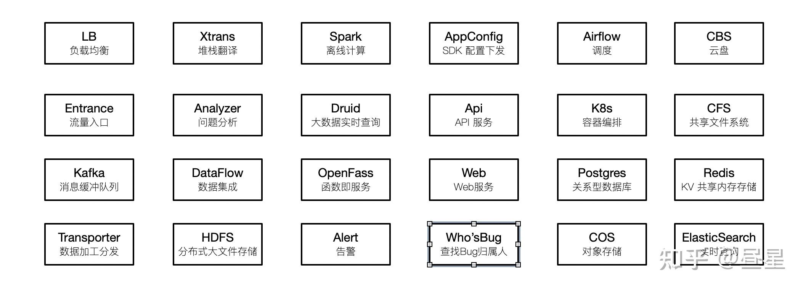
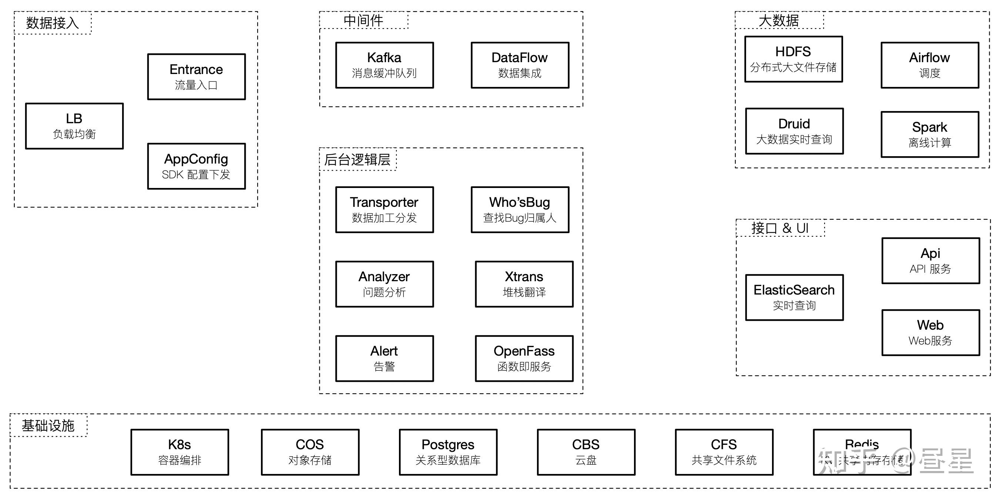
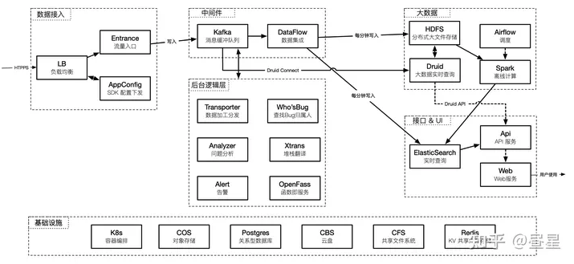
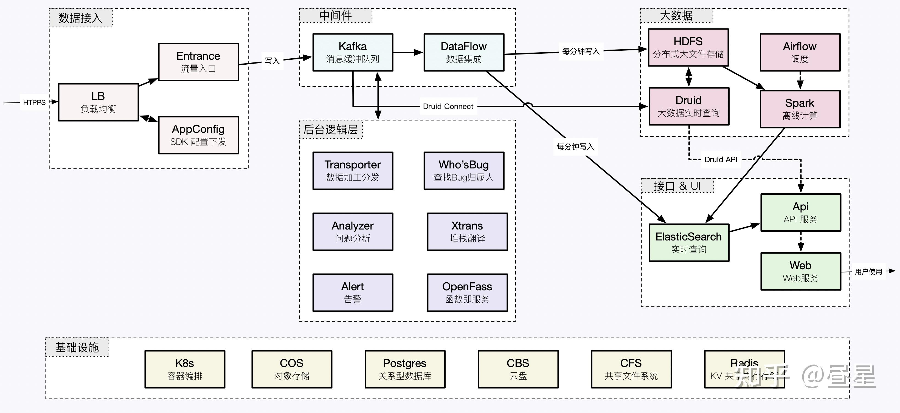
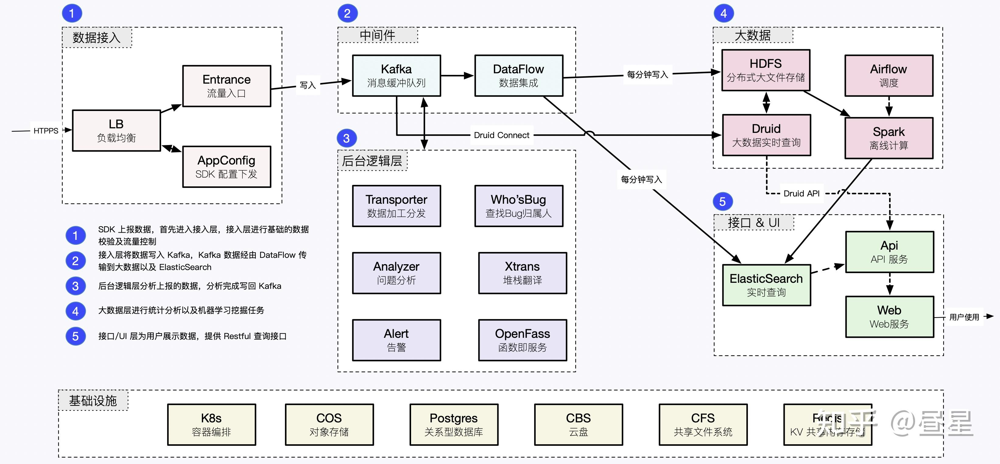

# 解读一副架构图

架构图复杂，读者就会嘀咕：为什么还要这么复杂？机构图简单，读者就会嘀咕：架构图意义在哪里？

不同的受众，把握正确的度，才能画出“合适”的架构图。

## 架构图立意

- 组件：有哪些
- 连线：如何协同工作以达成一定目的

## 组件

### 组件风格

- 方框 + 文字，简单务实风格；
- 方框 + 文字 + 图标，更为精致，更为商务的风格，适合作为产品对外架构宣讲；
- 文字 + 图标，去除方框后，更为简洁，适合组件少，内部架构文档；

#### Google Stack 架构

- 粗体大字号，组件名称
- 斜体小字号偏灰，组件描述，

### 组件颜色

- 架构分层，相同层级颜色一致，以强化层级概念；
- 自成逻辑，颜色有图例说明；
- 和外部团队合作，组件颜色用来标识团队职责范围；
- 混杂了自研和开源组件，组件颜色用来标识自研/开源；

## 连线

## 举例子

### 步骤 1: 列出组件

- 组件名加粗；
- 组件描述稍小字体；
- 字体偏细；

### 步骤 2: 逻辑分层/分块

这里主要是将众多模块按照**逻辑/功能**分为 N 个层/块。不同业务差别很大，尽量按照**普适容易理解**的方式划分。

### 步骤 3: 连线

组件间的连线就涉及细节了，主要是表达组件间的关系是什么。 这里将线分为了两类:

- **实线**: 写入流，对原始数据做处理，数据流量大
- **虚线**: 逻辑/查询流，查询数据，数据流量小

### 步骤 4: 涂色

涂色主要是为了美观，这里没有让涂色表达功能/团队职责划分，如果架构图有明确用途，可以根据目标调整配色。

### 步骤 5: 编号-标注

完工 !

备注：根据不同使用场合，需要微调一下。

## 参考

- [告别随手画架构图，从我做起 :)](https://zhuanlan.zhihu.com/p/419899429)