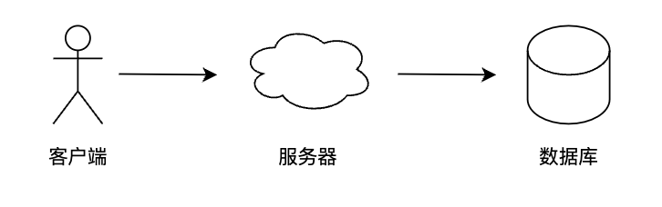
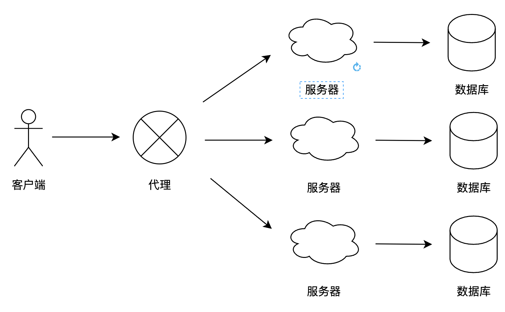
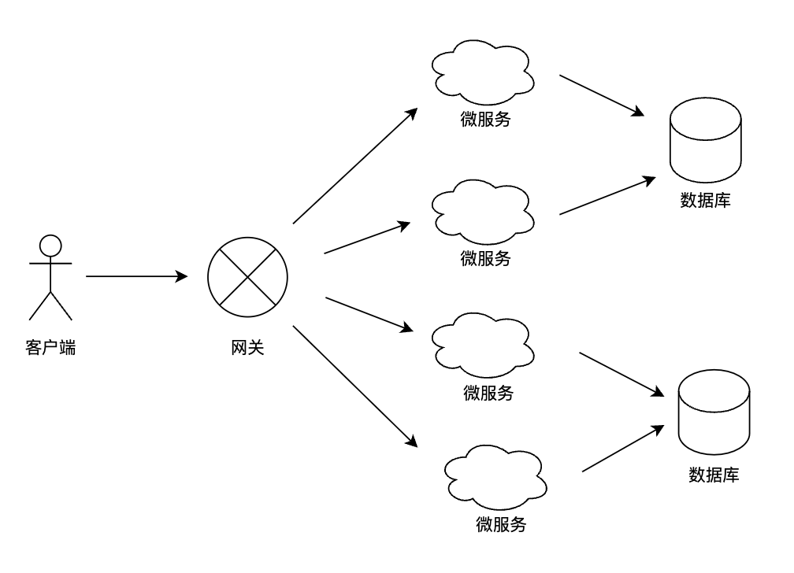
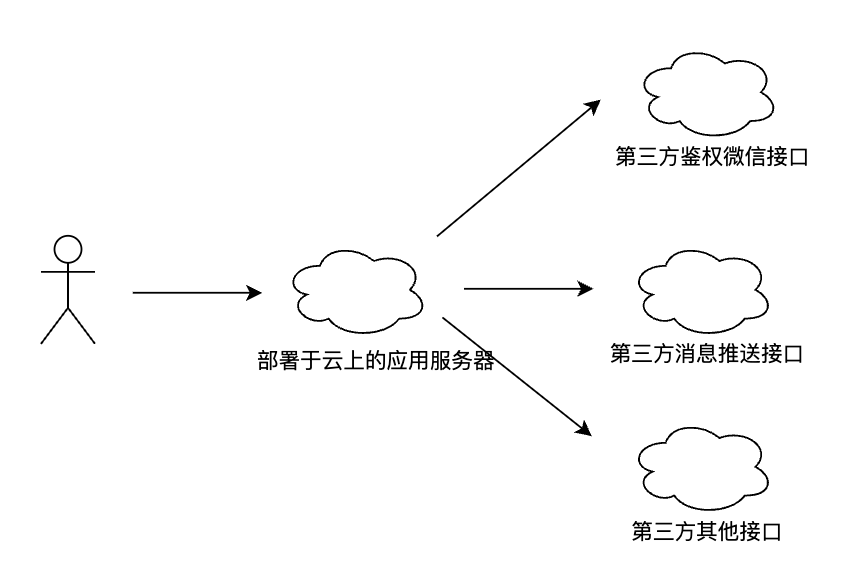

# 后端架构演进

## 单体架构

单体架构比较初级，典型的三级架构，比如 Java Spring mvc 或 Python Django 框架应用。架构图如下所示：

单体架构的应用比较容易部署和测试。项目初期可以很好运行，但随着需求不断增加，越多的人加入开发团队，代码库也在膨胀，单体应用变得臃肿，可维护性、灵活性逐渐减低。具体表现为：

- 复杂性高
- 技术债务
- 部署频率低
- 可靠性差
- 扩展能力受限
- 阻碍技术创新

## 分布式应用

分布式架构是将中间层和数据库进行分布式，将一个大的系统拆分成多个业务子系统，业务子系统分别部署在不同的服务器上，各业务模块之间通过接口进行数据交互。其代表有 redis、ES、solor等。

分布式架构提供了负载均衡的能力，解决了网站高并发的需求。包含以下特点：

- 降低了耦合度
- 责任清晰
- 扩展方便
- 部署方便
- 提高代码的复用性

缺点：
系统之间的交互要使用远程通信，接口开发增大工作量，但是利大于弊。

## 微服务架构

微服务架构将系统拆分成多个小应用（微服务），每个服务完成一个功能，微服务可部署在不同服务器上，也可以部署在相同服务器不同容器上。单应用的故障不会影响到其他应用，单应用的负载业不会影响其他应用，其代表有 Spring Cloud 和 Dubbo。其架构图如下所示：

包含以下特点：
- 易于开发和维护
- 单个微服务启动较快
- 局部修改容易部署
- 技术栈不受限
- 运维要求较高
- 分部署固有的复杂性
- 接口调整成本高
- 重复劳动

## Serverless 架构

Serverless 架构将应用程序的运行环境作为服务提供，开发者只需要关注业务逻辑，而无需关注服务器等底层资源。Serverless 架构是云计算的又一种表现形式，其代表有 AWS Lambda 和阿里云函数计算。

优点如下所示：

- 低运营成本
- 简化设备运维
- 提升可维护性
- 更快的开发速度
- 厂商平台绑定
- 成功案例较少，没有行业标准
