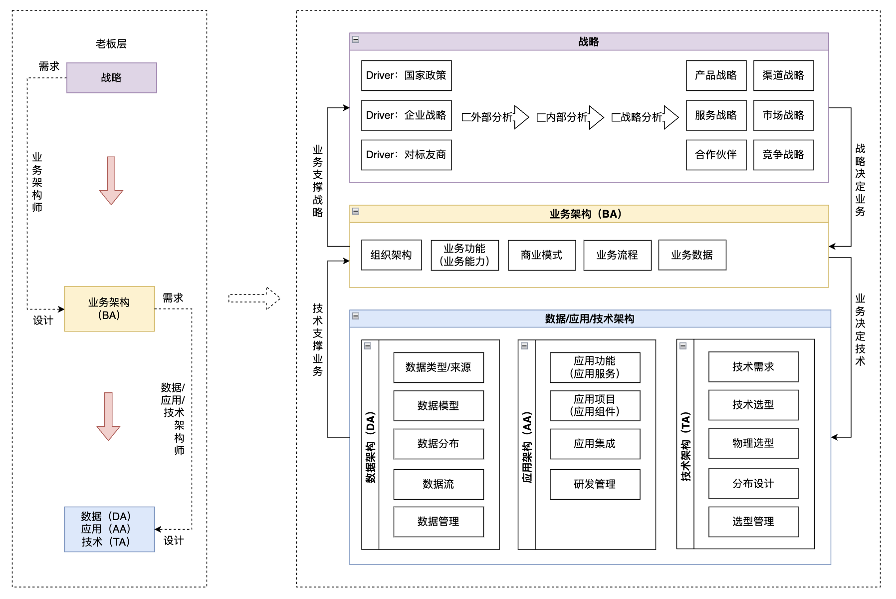

# 如何画一副好的架构图

在 TOGAF 企业架构理论中， 架构是从公司战略层面，自顶向下的细化的一部分，从**战略** => **业务架构** => **应用/数据/技术架构**。老板层关注的是战略与业务架构，搬砖的我们只需聚焦到**应用/数据/技术架构**这一层。

## 4+1视图

### 场景视图（用例视图）

用于描述系统的参与者与功能用例间的关系,反映系统的最终需求和交互设计，通常由**用例图**表示。

### 逻辑视图（结构视图）

用于描述系统软件功能拆解后的组件关系，组件约束和边界，反映系统整体组成与系统如何构建的过程，通常由**组件图**和**类图**来表示。

### 部署视图（物理视图）

用于描述系统软件到物理硬件的映射关系,反映出系统的组件是如何部署到一组可计算机器节点上，用于指导软件系统的部署实施过程。

### 实现视图（开发视图）

用于描述系统软件的实现过程，反映系统软件的实现过程，通常由**时序图**

### 行为视图（运行视图）
用于描述系统软件组件之间的通信时序,数据的输入输出,反映系统的功能流程与数据流程,通常由时序图和流程图表示。

https://bbs.huaweicloud.com/blogs/375202