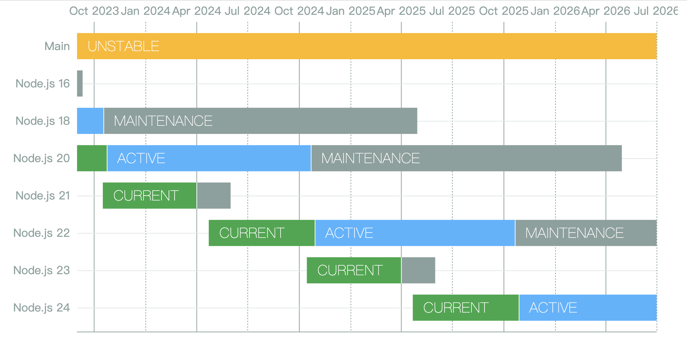

# Nodejs

## 版本发布

| 版本 | 发布时间 | 说明 |
|:-:|:-|:-|
| 22.x | 2024 年 04 月 24 日 | [更新日志](https://github.com/nodejs/node/blob/main/doc/changelogs/CHANGELOG_V22.md#22.0.0) |
| 21.x | 2023 年 10 月 17 日 | [更新日志](https://github.com/nodejs/node/blob/main/doc/changelogs/CHANGELOG_V21.md#21.0.0) |
| 20.x | 2023 年 04 月 18 日 | [更新日志](https://github.com/nodejs/node/blob/main/doc/changelogs/CHANGELOG_V20.md#20.0.0) |
| 19.x | 2022 年 10 月 18 日 | [更新日志](https://github.com/nodejs/node/blob/main/doc/changelogs/CHANGELOG_V19.md#19.0.0) |
| 18.x | 2022 年 04 月 19 日 | [更新日志](https://github.com/nodejs/node/blob/v18.x/doc/changelogs/CHANGELOG_V18.md#18.0.0) |
| 17.x | 2021 年 10 月 19 日 | [更新日志](https://github.com/nodejs/node/blob/v18.x/doc/changelogs/CHANGELOG_V17.md#17.0.0) |
| 16.x | 2021 年 04 月 20 日 | [更新日志](https://github.com/nodejs/node/blob/main/doc/changelogs/CHANGELOG_V16.md#16.0.0) |
| 15.x | 2020 年 10 月 20 日 | [更新日志](https://github.com/nodejs/node/blob/main/doc/changelogs/CHANGELOG_V15.md#15.0.0) |
| 14.x | 2020 年 04 月 21 日 | [更新日志](https://github.com/nodejs/node/blob/main/doc/changelogs/CHANGELOG_V14.md#14.0.0) |
| 13.x | 2019 年 10 月 22 日 | [更新日志](https://github.com/nodejs/node/blob/main/doc/changelogs/CHANGELOG_V13.md#13.0.0) |
| 12.x | 2019 年 04 月 23 日 | [更新日志](https://github.com/nodejs/node/blob/main/doc/changelogs/CHANGELOG_V12.md#12.0.0) |
| 11.x | 2018 年 10 月 23 日 | [更新日志](https://github.com/nodejs/node/blob/main/doc/changelogs/CHANGELOG_V11.md#11.0.0) |
| 10.x | 2018 年 04 月 24 日 | [更新日志](https://github.com/nodejs/node/blob/main/doc/changelogs/CHANGELOG_V10.md#10.0.0) |
| 9.x  | 2017 年 10 月 31 日 | [更新日志](https://github.com/nodejs/node/blob/main/doc/changelogs/CHANGELOG_V9.md#9.0.0) |
| 8.x  | 2017 年 05 月 30 日 | [更新日志](https://github.com/nodejs/node/blob/main/doc/changelogs/CHANGELOG_V8.md#8.0.0) |
| 7.x  | 2016 年 10 月 25 日 | [更新日志](https://github.com/nodejs/node/blob/main/doc/changelogs/CHANGELOG_V7.md#7.0.0) |
| 6.x  | 2016 年 04 月 26 日 | [更新日志](https://github.com/nodejs/node/blob/main/doc/changelogs/CHANGELOG_V6.md#6.0.0) |
| 5.x  | 2015 年 10 月 29 日 | [更新日志](https://github.com/nodejs/node/blob/main/doc/changelogs/CHANGELOG_V5.md#5.0.0) |
| 4.x  | 2015 年 09 月 08 日 | [更新日志](https://github.com/nodejs/node/blob/main/doc/changelogs/CHANGELOG_V4.md#4.0.0) |
| 0.12.x | 2015 年 02 月 06 日 | [更新日志](https://github.com/nodejs/node/blob/main/doc/changelogs/CHANGELOG_V012.md#0.12.0) |
| 0.10.x | 2013 年 03 月 11 日 | [更新日志](https://github.com/nodejs/node/blob/main/doc/changelogs/CHANGELOG_V010.md#0.10.0) |
| io.js | - | [更新日志](https://github.com/nodejs/node/blob/main/doc/changelogs/CHANGELOG_IOJS.md#1.0.0)  
| Archive | - | [更新日志](https://github.com/nodejs/node/blob/main/doc/changelogs/CHANGELOG_ARCHIVE.md)  

## 软件下载

- [软件发行版列表信息](https://nodejs.org/zh-cn/about/previous-releases)
