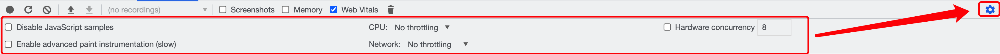
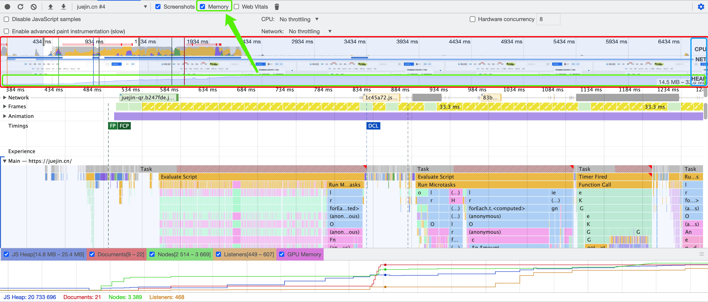

# Performance Panel

性能面板。

- 控制区域（红色区域）：功能配置项。
- 概览区域（蓝色区域）：性能可视化。
- 视图区域（绿色区域）：展示概览区域（蓝色区域）中选择片段的指标数据。
- 详情区域（黄色区域）：展示视图区域（绿色区域）中选择内容的详情数据。
- 搜索框域（黑色区域）：按 Command+F (Mac) 或 Control+F（Windows、Linux）打开底部的搜索框，可对 【Main】 中火焰图中的活动进行搜索。

## 控制区域

从左至右的功能分别为：

- `Record` 录制: **开始/停止**记录页面运行时性能，再次**手动点击结束**记录并生成分析报告。
- `Start profiling and load page` 开始分析并重新加载网页: 重新加载页面并记录页面加载时的性能，页面加载完成后会**自动停止**记录并生成分析报告。
- `Clear` 清除: 清空所有录制的分析内容。
- `Load profile` 加载性能分析报告：上传之前保存的分析报告。
- `Save profile` 保存性能分析报告：将当前记录的分析内容以 JSON 文件形式保存。每次记录都会生成一个性能分析报告可供保存（下载），也可截取记录中的某段内容生成分析报告进行保存。**使用场景**：保存文件可传给他人，他人可使用 Load profile 来加载（上传）到自己的浏览器开发者工具上进行协作分析。
- `Show recent timeline sessions` 显示近期时间轴会话: 选择最近的性能分析记录进行显示。使用场景：可方便对比之前的数据，太贴心了。
- `Screenshots` 是否显示屏幕截图：默认勾选，勾选后后将会在录制时捕获每一帧的屏幕截图。
- `Memory` 是否显示内存指标：勾选后会展示一个内存线形图，并且 NET 图表下方会展示一个 HEAP 图。HEAP 图与内存图中 JS Heap 的信息相同，表示JS 堆内存，内存飙升可能意味着内存泄漏，内存不足又可能引发页面崩溃。浏览器在回收内存时还会暂停执行 JS，从而使得页面因为 GC（垃圾回收）而出现卡顿或频繁暂停现象。而JS heap 选项右边分别是文档、DOM 节点、监听器和 GPU 内存的内存使用情况，这些内存使用变化可能与JS 执行存在相关性（比如某个事件执行注入了大量的节点）。
- Web Vitals: 展示能够最快提升当前网页性能表现的核心指标和影响因素，类似一个简易的 [Lighthouse](./chrome-devtools-lighthouse.md)。
  - 绿色圆点表示**健康**表现的指标
  - 黄色方形表示**中等**表现的指标
  - 红色菱形表示**较差**表现的指标
- `Collect rubbish` 回收垃圾: 点击其强制进行垃圾收集。

- `Disable JavaScript samples` 关闭 JavaScript 样本：减少在手机运行时的开销。使用场景：模拟手机运行时勾选。
- `CPU` CPU 限制：主要为了模拟低 CPU 下运行性能。常用于模拟移动设备 CPU，由于移动设备的 CPU 能力远低于 PC，若设置 4x slowdown 则表示 DevTools 会限制当前 CPU 使其比现在慢 4 倍。
- `Enable advanced paint instrumentation(slow)` 记录渲染事件的细节：用于开启一些高级分析功能，比如图层信息、Paint 分析器等。选择 frames 中的一块，可以看到紫色区域多了个 Layers。
- `Network` 网络模拟：可以模拟用于模拟弱网或离线网络状态下运行页面。

## 概览区域

性能面板为 FPS、CPU 和 NET 图表数据的概览，在概览上向左或向右拖动鼠标、或点击某区域可选择其中一部分录制内容。

- 蓝色框选就是 FPS、CPU 和 NET 标识，对应红色框选内容。
- 绿色区域就是 Memory 整体表现情况，需在控制面板将 Memory 选项勾选上才可展示。

### FPS

Frames Per Second 每秒帧数。通常情况下 FPS 越高越好，当 FPS >= 60 时页面刷新频率能与大多数浏览器的刷新频率（60Hz）相吻合。那如何看 FPS 呢？

- 若 FPS 上**红色条**时就意味着出现长时间帧（帧率下降），从而出现页面卡顿有损用户体验。
- 若 FPS 上**绿色条**越高则表示 FPS 越高，用户体验越好。

### CPU

CPU 资源使用情况。CPU 中面积图如果充满色彩就表示该时间段 CPU 已达到极限。当看到 CPU 长时间处于最大状态时就是需要寻找减少 CPU 工作量方法的提示。

不同颜色的面积图表示不同的消耗 CPU 资源的事件类型，并且面积图中的各种颜色与 Summary 中的颜色相对应：

- 蓝色 Loading：表示正在加载（网络通信和 HTML 解析）时间。
- 黄色 Scripting：表示正在执行脚本时间。
- 紫色 Rendering：表示渲染（样式计算和布局）时间。
- 绿色 Painting：表示绘制时间。
- 灰色 other：表示其它事件花费的时间。
- 白色 Idle：表示空闲时间。

### NET

Network 概览。深蓝色表示存在高优先级的资源请求的时间段，浅蓝色表示存在低优先级的资源请求的时间段。

### HEAP

JS heap 使用情况。与开启 Memory 后的 JS heap 线形图一致。

## 视图区域

### Frames

查看每秒帧数。将鼠标悬停在其中一个绿色方块上会显示该帧的耗时和 FPS，如出现红色方块则表示出现掉帧。点选某帧可在 Summary 看到更多信息（触发该帧的相对时间和 CPU time）。

那如何查看分层信息呢？

- 开启图层信息：控制面板开启 Enable advanced paint instrumentation。
- 在 Frames 栏中选择某一帧，分层信息将在详情面板中的 Layers 选项卡中展示，可查看分层结果是否符合期望。

### Timings

记录页面加载期间的重要阶段事件及其触发时间点。

- FP（First Paint）：页面第一个像素渲染到屏幕上所用的时间。
- FCP（First Contentful Paint）：开始绘制内容的时间，内容包括任何文字、图片、非空白的 canvas 或 SVG 等。
- LCP（Largest Contentful Paint）：页面可视区内尺寸最大的元素完成渲染的时间。
- DCL（DOMContentLoaded）: 表示 HTML 已完全加载和解析，此时样式、图像、iframe 等可能尚未加载。
- L（Onload）：页面所有资源加载完成后触发的事件。

### Main

主线程活动。通过**倒置的火焰图**展示主线程上发生的活动。

- x 轴表示随时间的记录。
- y 轴代表调用堆栈。

**如何看火焰图？**
火焰图中**顶部的事件会导致其下方的事件**，火焰图**顶层宽度越大**就表示该活动**可能存在性能问题**。

默认情况下，Main 中会详细记录 JavaScript 的调用堆栈，勾选 Disable JavaScript samples 可隐藏其调用堆栈，隐藏后的火焰图明显变低。

**如何查看长任务 Longtask？**

火焰图顶部（根部）由很多任务（Task）组成，使用**灰色背景色**区分。鼠标悬浮上去可以看到任务的总耗时。

- 规范：**超过 50ms** 的任务被称之为**长任务**，会被**红色角标**标记。因此 Main 视图中可查看导致掉帧的具体任务。

**如何查看火焰图中的活动？**

点击选择火焰图的某一活动或者选择某一时间段的活动，将在详情区域 Summary 选项卡中展示更多信息，结合详情面板的 Call tree、Bottom-up、Event log 选项卡可以进行不同维度分析。

**根活动**

根活动是指那些导致浏览器做一些工作的活动，例如当单击一个页面时浏览器会触发一个 Event 作为根活动，这个 Event 可能会导致一系列的处理程序执行等。

根活动位于在火焰图中顶部，Task 的下方，也会出现在 Call tree、Event log 选项卡 Activity 列的首行。

## 详情区域

### Summary

摘要，展示点选活动或某时间段所有活动的各阶段时间耗时。

- Loading：网络请求与解析。
- Scripting: JS 执行时间。
- Rendering: 重排，主要包含样式计算、更新布局树、布局、分层等。
- Painting：重绘。更新分层、光栅化分层、合成等。
- System: 系统占用时间。
- Idle: 空闲时间。
- Total: 总计。

### Call tree

调用树，通常用于查看选择的时间段中导致最多耗时的根活动。

下图中 Event 是一个根活动，嵌套结构表示表示调用栈，表示 Event 导致了 button.addEventListener，button.addEventListener 中执行了 b...

- Self Time：该活动直接花费的时间。
- Total Time：该活动和其所有子活动花费的时间。

### Bottom-up

自下而上（栈底到栈顶），通常用于查看选择的时间段中直接花费时间最多的活动。

上面图例中可以看到几乎所有时间都花在了三个wait()的调用上。因此Bottom-up选项卡中的顶部活动是wait。观察火焰图部分可以wait实际上是数千个Minor GC调用。因此你可以看到在Bottom-up选项卡中下一个最昂贵的活动是Minor GC。

- Self Time：该活动直接花费的时间的汇总时间，因为其可能出现了多次。
- Total Time：该活动和其所有子活动花费的时间的总时间。

### Event log

事件日志，用于按照活动的发生顺序查看活动。

- Start Time: 该活动的启动时间，它相对于录制的开始时间。
- Self Time：直接在该活动上花费的时间。
- Total Time：直接在该活动及其所有子活动上花费的时间。

## 搜索框域

按 Command+F (Mac) 或 Control+F（Windows、Linux）打开底部的搜索框，可对火焰图中的活动进行搜索，支持正则。
