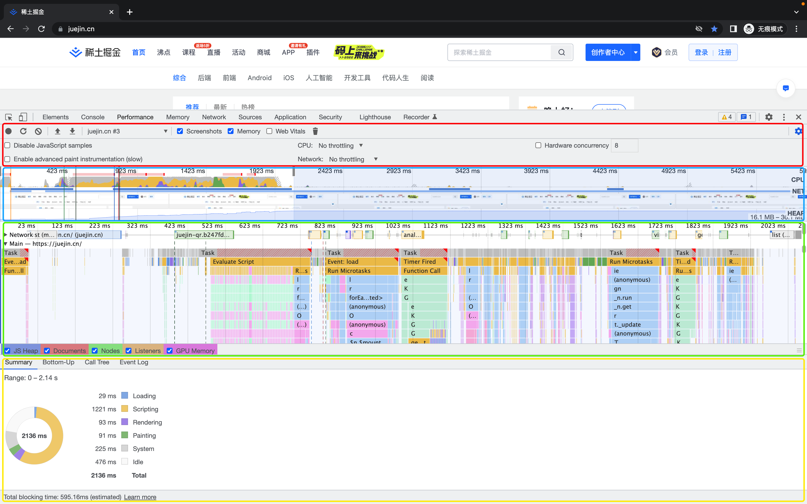
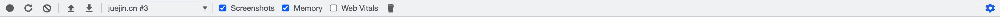

# Performance Panel

性能面板。

## 面板概览

- 控制区域（红色区域）：功能配置项。
- 概览区域（蓝色区域）：性能可视化。
- 视图区域（绿色区域）：展示概览区域（蓝色区域）中选择片段的指标数据。
- 详情区域（黄色区域）：展示视图区域（绿色区域）中选择内容的详情。

## 控制区域

从左至右的功能分别为：

- `Record` 录制: **开始/停止**记录页面运行时性能，再次**手动点击结束**记录并生成分析报告。
- `Start profiling and load page` 开始分析并重新加载网页: 重新加载页面并记录页面加载时的性能，页面加载完成后会**自动停止**记录并生成分析报告。
- `Clear` 清除: 清空所有录制的分析内容。
- `Load profile` 加载性能分析报告：上传之前保存的分析报告。
- `Save profile` 保存性能分析报告：将当前记录的分析内容以 JSON 文件形式保存。每次记录都会生成一个性能分析报告可供保存（下载），也可截取记录中的某段内容生成分析报告进行保存。**使用场景**：保存文件可传给他人，他人可使用 Load profile 来加载（上传）到自己的浏览器开发者工具上进行协作分析。
- `Show recent timeline sessions` 显示近期时间轴会话: 选择最近的性能分析记录进行显示。使用场景：可方便对比之前的数据，太贴心了。
- `Screenshots` 是否显示屏幕截图：默认勾选，勾选后后将会在录制时捕获每一帧的屏幕截图。
- `Memory` 是否显示内存指标：勾选后会展示一个内存线形图，并且 NET 图表下方会展示一个 HEAP 图。HEAP 图与内存图中 JS Heap 的信息相同，表示JS 堆内存，内存飙升可能意味着内存泄漏，内存不足又可能引发页面崩溃。浏览器在回收内存时还会暂停执行JS，从而使得页面因为 GC（垃圾回收）而出现卡顿或频繁暂停现象。而JS heap 选项右边分别是文档、DOM 节点、监听器和 GPU 内存的内存使用情况，这些内存使用变化可能与JS 执行存在相关性（比如某个事件执行注入了大量的节点）。

作者：工具我那都齐
链接：<https://juejin.cn/post/7112544960934576136>
来源：稀土掘金
著作权归作者所有。商业转载请联系作者获得授权，非商业转载请注明出处。

- `Disable javaScript samples` 关闭 JavaScript 样本：减少在手机运行时的开销。使用场景：模拟手机运行时勾选。
- `Network` 网络模拟：可以模拟在 3G、4G 等网络条件下运行页面。
- `Enable advanced paint instrumentation(slow)` 记录渲染事件的细节：选择 frames 中的一块，可以看到紫色区域多了个Layers。
- `CPU` CPU 限制：主要为了模拟低 CPU 下运行性能。

## 概览区域

## 视图区域

## 详情区域

- `Summary` 数据总览：不同的点击项目展示的条目有所区别。
  - `Bottom-up、Call tree、Event log 选项卡主要与主线程活动相关
