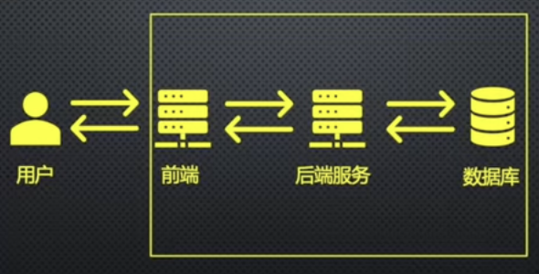
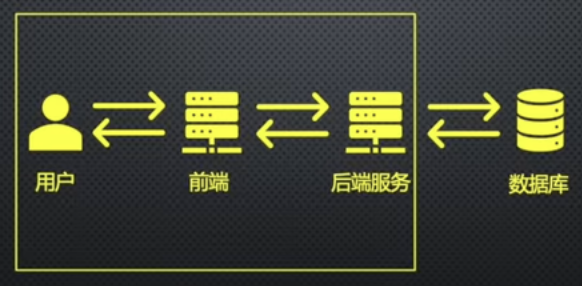
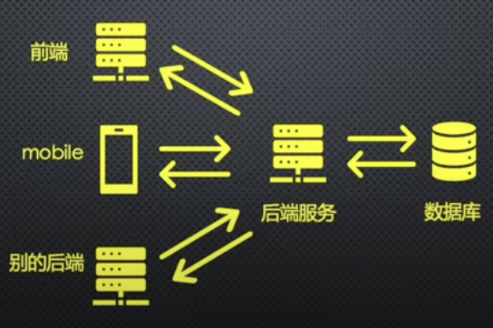

# 开发者角色

粗略的分为以下几种：
- 前端开发
- 后端开发
- 全栈开发

## 前端开发 Frontend Development

简单来说就是开发网页上的**内容展示**和**用户交互**。

- **内容展示**包含：文字、图片、视频、音频、图表等数字信息；
- **用户交互**包含：点击、滑动、拖拽、点击输入框等，对网站提供**输入**，前端开发对输入内容进行响应，如更新**内容展示**；

### 基础技术

基础技术（底层技术）包含 HTML、CSS 和 JavaScript。之所以叫基础技术是因为被几乎全部的前端应用使用到。

- HTML：控制内容及内容结构；
- CSS：控制内容视觉呈现及内容布局；
- JavaScript：控制用户交互及内容逻辑；

### 应用技术

#### 渲染方式

生成 HTML 代码方式，也可以描述为 HTML 代码渲染方式。

- 浏览器端生成 HTML 代码的方式叫**客户端渲染** Client-side Rendering, 简称 CSR；
- 服务器端生成 HTML 代码的方式叫**服务器端渲染** Server-side Rendering, 简称 SSR；

了解[更多前端开发知识可移步](../frontend/README.md)。

## 后端开发 Backend Development

简单来说就是开发**数据访问服务**。使前端可以通过调用**数据访问服务（接口）**对数据进行增（Create）、删（Delete）、改（Update）、查（Read），也就是大家经常说的**CRUD**，实现前端对用户的请求响应。

**后端服务视角**

后端服务通过查询数据库来完成对前端请求的响应。

**前端视角**

前端通过调用后端服务来完成对用户的请求响应。

前端和后端的共性都是调用一个比自己更靠后的服务来对前方的客户请求进行响应。

### 后端工作内容

要做系统设计 System Design，包括：

- 设计后端服务API
- 设计后端服务的架构图
  - 保障设计的后端服务的高可用 highly available
  - 保障设计的后端服务的高性能 highly performant
  - 保障设计的后端服务的高可扩展性 highly scalable
- 设计后端服务的数据库表结构
- 编码实现后端服务的业务逻辑

## 全栈开发 Fullstack development