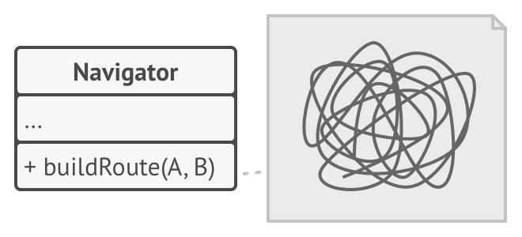
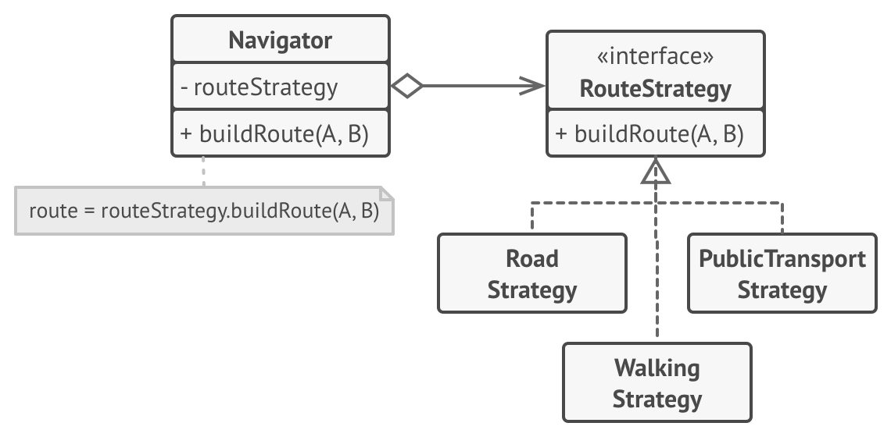
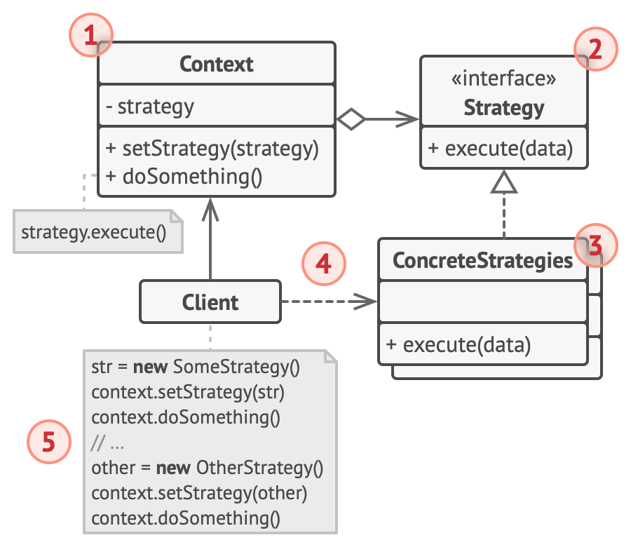

# 策略模式

> 本文原文：https://refactoringguru.cn/design-patterns/strategy

策略模式可以定义一系列算法，并将每种算法分别放入独立的类中，以使算法的对象能够相互转换。


## 模拟场景问题

一天， 你打算为游客们创建一款导游程序。 该程序的核心功能是提供美观的地图， 以帮助用户在任何城市中快速定位。

用户期待的程序新功能是自动路线规划： 他们希望输入地址后就能在地图上看到前往目的地的最快路线。

程序的首个版本只能规划公路路线。 驾车旅行的人们对此非常满意。 但很显然， 并非所有人都会在度假时开车。 因此你在下次更新时添加了规划步行路线的功能。 此后， 你又添加了规划公共交通路线的功能。

而这只是个开始。 不久后， 你又要为骑行者规划路线。 又过了一段时间， 你又要为游览城市中的所有景点规划路线。



尽管从商业角度来看， 这款应用非常成功， 但其技术部分却让你非常头疼： 每次添加新的路线规划算法后， 导游应用中主要类的体积就会增加一倍。 终于在某个时候， 你觉得自己没法继续维护这堆代码了。

无论是修复简单缺陷还是微调街道权重， 对某个算法进行任何修改都会影响整个类， 从而增加在已有正常运行代码中引入错误的风险。

此外， 团队合作将变得低效。 如果你在应用成功发布后招募了团队成员， 他们会抱怨在合并冲突的工作上花费了太多时间。 在实现新功能的过程中， 你的团队需要修改同一个巨大的类， 这样他们所编写的代码相互之间就可能会出现冲突。

## 解决方案

策略模式建议找出负责用许多不同方式完成特定任务的类， 然后将其中的算法抽取到一组被称为策略的独立类中。

名为上下文的原始类必须包含一个成员变量来存储对于每种策略的引用。 上下文并不执行任务， 而是将工作委派给已连接的策略对象。

上下文不负责选择符合任务需要的算法——客户端会将所需策略传递给上下文。 实际上， 上下文并不十分了解策略， 它会通过同样的通用接口与所有策略进行交互， 而该接口只需暴露一个方法来触发所选策略中封装的算法即可。

因此， 上下文可独立于具体策略。 这样你就可在不修改上下文代码或其他策略的情况下添加新算法或修改已有算法了。



在导游应用中， 每个路线规划算法都可被抽取到只有一个 `build­Route 生成路线` 方法的独立类中。 该方法接收起点和终点作为参数， 并返回路线中途点的集合。

即使传递给每个路径规划类的参数一模一样， 其所创建的路线也可能完全不同。 Navigator 导游类的主要工作是在地图上渲染一系列中途点， 不会在意如何选择算法。 该类中还有一个用于切换当前路径规划策略的方法， 因此客户端 （例如用户界面中的按钮） 可用其他策略替换当前选择的路径规划行为。

## 真实世界类比


假如你需要前往机场。 你可以选择乘坐公共汽车、 预约出租车或骑自行车。 这些就是你的出行策略。 你可以根据预算或时间等因素来选择其中一种策略。

## 策略模式结构



1.上下文 （Con­text） 维护指向具体策略的引用， 且仅通过策略接口与该对象进行交流。

2.策略 （Strat­e­gy） 接口是所有具体策略的通用接口， 它声明了一个上下文用于执行策略的方法。

3.具体策略 （Con­crete Strate­gies） 实现了上下文所用算法的各种不同变体。

4.当上下文需要运行算法时， 它会在其已连接的策略对象上调用执行方法。 上下文不清楚其所涉及的策略类型与算法的执行方式。

5.客户端 （Client） 会创建一个特定策略对象并将其传递给上下文。 上下文则会提供一个设置器以便客户端在运行时替换相关联的策略。

## 伪代码

在本例中， 上下文使用了多个策略来执行不同的计算操作。原文是 java daima 

```js
// 待完善
```

## 适合应用场景

> Q: 当你想使用对象中各种不同的算法变体， 并希望能在运行时切换算法时， 可使用策略模式。
>
A: 策略模式让你能够将对象关联至可以不同方式执行特定子任务的不同子对象， 从而以间接方式在运行时更改对象行为。

> Q: 当你有许多仅在执行某些行为时略有不同的相似类时， 可使用策略模式。
>
A: 策略模式让你能将不同行为抽取到一个独立类层次结构中， 并将原始类组合成同一个， 从而减少重复代码。

> Q: 如果算法在上下文的逻辑中不是特别重要， 使用该模式能将类的业务逻辑与其算法实现细节隔离开来。
>
A: 策略模式让你能将各种算法的代码、 内部数据和依赖关系与其他代码隔离开来。 不同客户端可通过一个简单接口执行算法， 并能在运行时进行切换。

> Q: 当类中使用了复杂条件运算符以在同一算法的不同变体中切换时， 可使用该模式。
>
A: 策略模式将所有继承自同样接口的算法抽取到独立类中， 因此不再需要条件语句。 原始对象并不实现所有算法的变体， 而是将执行工作委派给其中的一个独立算法对象。

##  实现方式

## 优缺点

## 与其他模式的关系