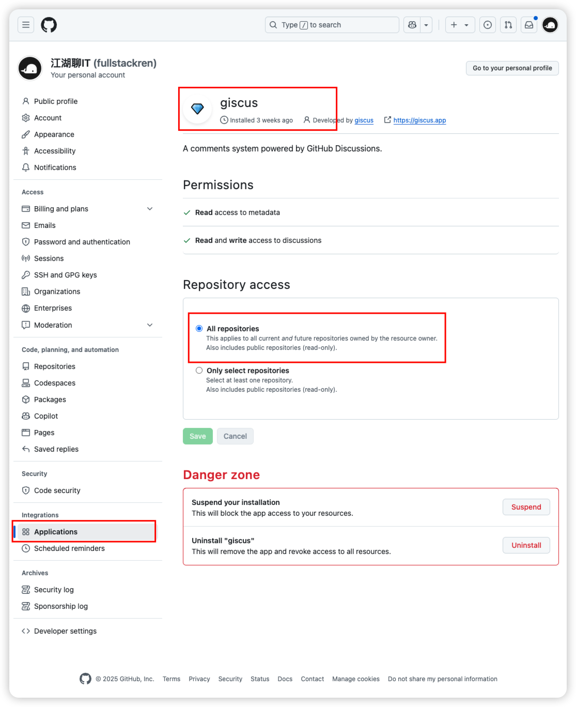
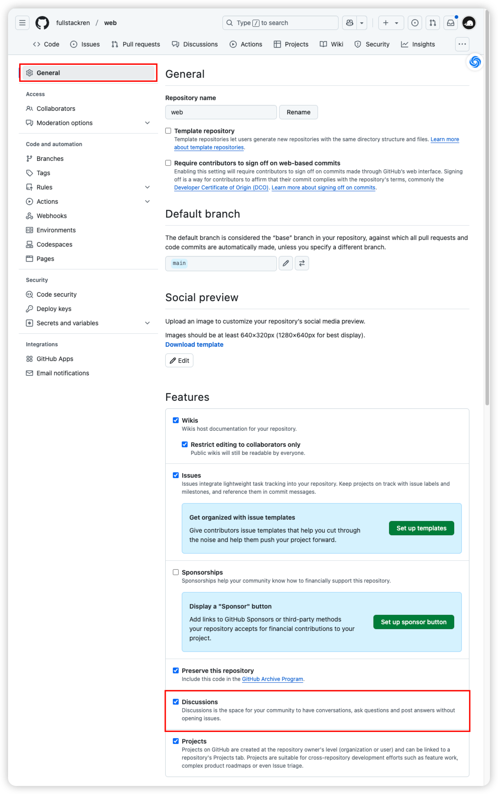
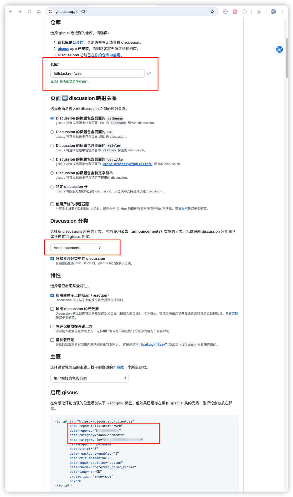

# 博客打造品牌影响力

## 01<br />打造品牌影响力

## 02<br />为什么是博客

## 03<br/>博客搭建

### 博客评论系统

主要使用 [Giscus](https://giscus.app/zh-CN) 来实现评论功能，使用 GitHub Issues 作为评论数据库，使用 GitHub OAuth 进行身份验证。

#### github 配置

选择 giscus 连接到的仓库。请确保：

1、该仓库是[公开的](https://docs.github.com/zh/repositories/managing-your-repositorys-settings-and-features/managing-repository-settings/setting-repository-visibility)，否则访客将无法查看 discussion。
2、giscus app 已安装，否则访客将无法评论和回应。

3、Discussions 功能已在你的仓库中启用。


#### giscus 配置

1、设置仓库。
2、选择 Discussion 分类，推荐使用公告（announcements）类型。
3、获取 vitepress 需要的仓库和分类配置。



#### vitepress 配置

将【启动 giscus 】中的红色框选数据填入 vitepress 配置文件中。

```js
export default defineConfig({
  themeConfig: {
    comment: {
      repo: 'your-github-repo', // GitHub repository
      repoId: 'your-github-repo-id', // GitHub repository ID
      category: 'Comments', // GitHub category
      categoryId: 'your-github-category-id', // GitHub category ID
    }
  }
});
```

