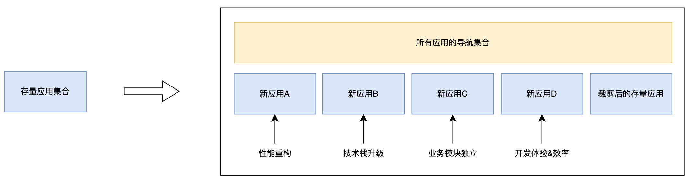

# 微前端背景

**终端用户体验侧**，客户对于性能较差的前端应用，要求性能上提升，为了不影响终端用户的操作使用，接受逐步技术重构来实现性能优化；

**业务合同侧**，客户对于前端应用技术栈上有技术栈升级要求，比如新的模块要求使用 [Vue.js@3.x](../vue/README.md) 开发（可能是客户公司的领导听了`前端技术架构师`的建议） ，而不继续采用  [Vue.js@2.x](../vue/README.md)  技术栈。

**组织架构侧**，某项业务需要单独汇报或管理，人员组织架构已经调整，为了更加方便地独立管理对应的业务模块，所以业务模块也需要独立出来维护和部署。

**开发体验侧**，随着业务功能迭代，应用规模越来越大，项目本地服务启动时间越来越长，构建服务亦是如此，为了减少编译时长提升开发效率，认可拆成多个应用；

为了满足上述特性，在尽可能改动量少的前提下（不是新功能特性，客户认为其价值只值得一小笔投入，毕竟客户侧负责人也要向上汇报的），前端的改动如下：

将`存量应用集合`拆分成`多个新的应用`后，再配置一个`所用应用的导航集合`，就可以将业务流程玩转起来了，这种架构方式就是`微前端`，也可以称作是`微应用`，因为系统都是由一个个微小的应用组合而成（哪怕是`所用应用的导航集合`，其本质也是一个微小的应用）。

由此可以看出，微前端架构可以打破`技术栈带来的限制`，让不同的团队可以使用不同的技术栈，并且可以`独立开发、独立部署`，加快项目交付速度，`提升开发效率`，降低维护成本。

## 参考

- [微前端架构](https://micro-frontends.org/)
