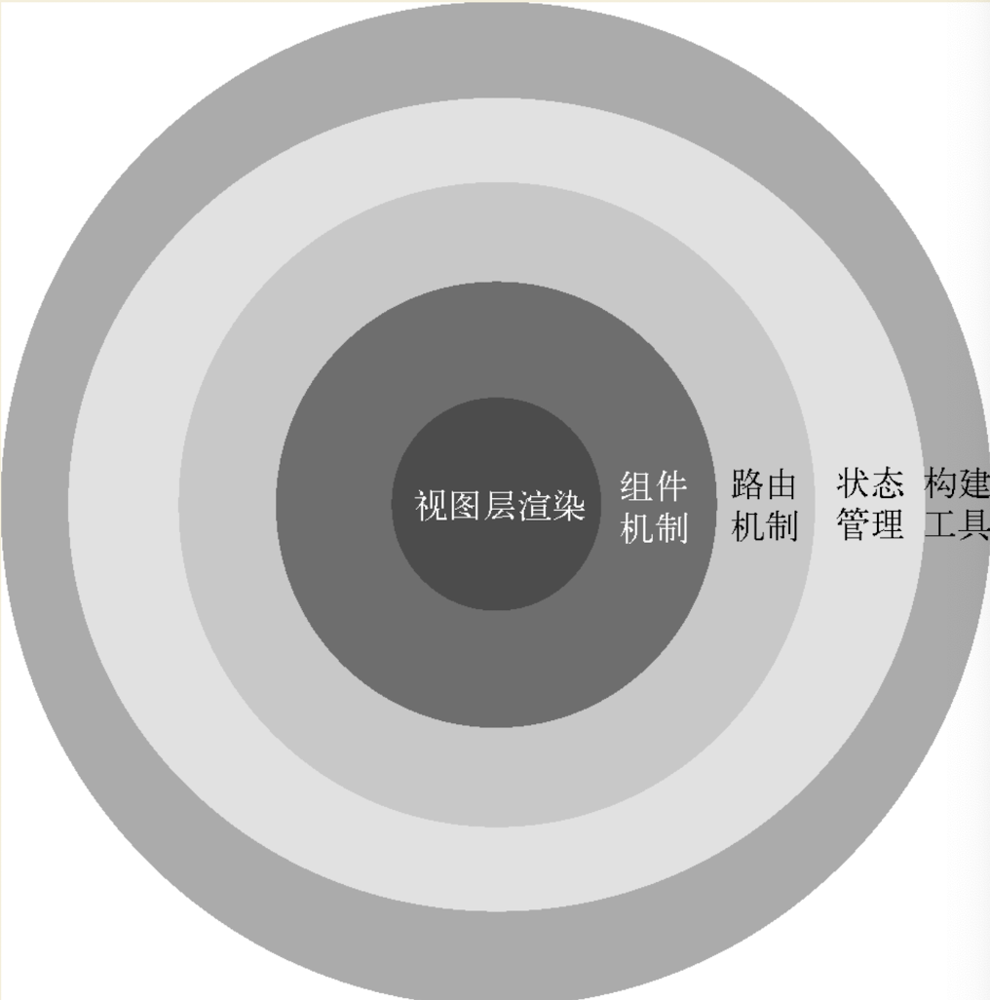

# Vue

Vue.js，通常简称为Vue，是一款易学易用，性能出色，适用场景丰富的 Web 前端渐进式的 JavaScript 框架。

## 框架分层

## 资源

- [Vue3 官方中文文档](https://cn.vuejs.org/)
- [Vue2 官方中文文档](https://v2.cn.vuejs.org/)
- [Vue 版本发布](./vue-versions.md)
