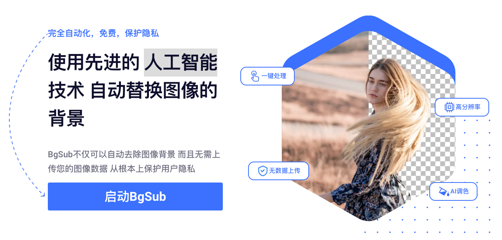
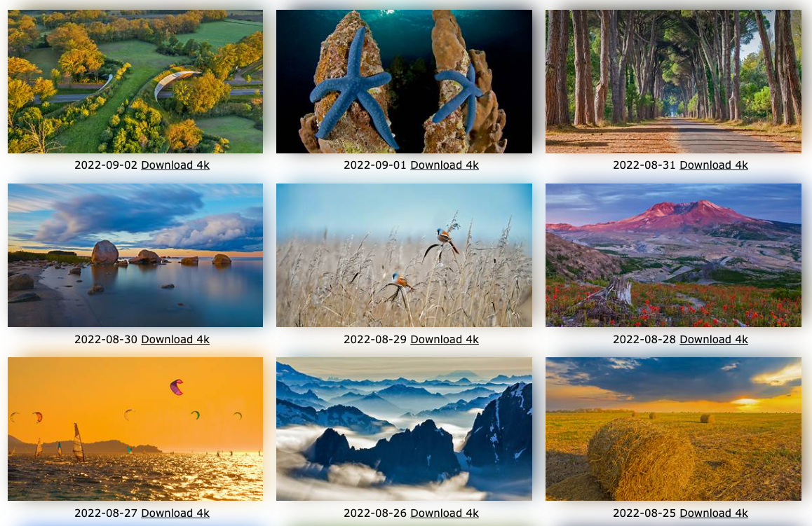
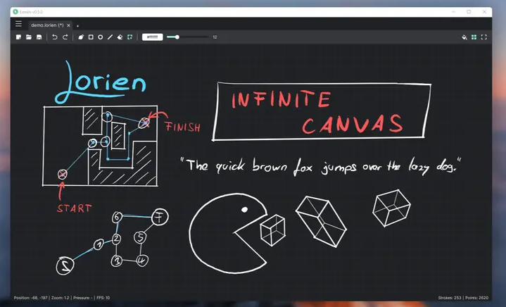

# 图片

## 在线画图

- [youidraw](https://www.youidraw.com/apps/painter/)
## AI 换背景

> 官网：https://bgsub.cn/

一个网页工具，可以自动抠图，替换背景颜色或背景图片，完全在本地完成，不会上传服务器。

## 必应壁纸

> 地址：https://bing.wdbyte.com/

周刊介绍过一个抓取必应每日壁纸的 [GitHub Actions 模板](https://github.com/niumoo/bing-wallpaper)，作者现在将其做成静态网站，可以在线浏览和下载壁纸，每日更新。

## 共享白板

> 地址：https://www.ourboard.io/

一个在线白板，你创建一个房间，把网址分享给其他人，大家就可以在一块网页白板上共同涂写。

## 图片处理

> 地址：https://cleanupphotos.com/

这个网页工具可以清除照片上不要的物体。用户上传照片以后，框选不需要的物体，系统会自动清除这些物体，用背景填充照片。

## 在线生成 favicon

> 地址：[https://favicon.io/](https://favicon.io/)

网站图标 Favicon 的在线生成工具。

## 绘图软件

> 下载地址：https://github.com/mbrlabs/Lorien/releases

一个绘图 + 笔记的画布软件，可以导出 SVG 格式。底层使用 Godot 游戏引擎，图形性能非常好，支持 Linux/Mac/Windows 系统。

## Emoji 厨房

> 原文：https://blog.google/products/android/feeling-all-the-feels-theres-an-emoji-sticker-for-that/

- [Emoji Kitchen](https://emojikitchen.dev/)
- [Emojimix](https://tikolu.net/emojimix/)
- [Emoji Supply](https://emoji.supply/kitchen/)
- [Emoji 壁纸工具](https://emoji.supply/wallpaper/?pattern=foam&order=random&emoji=%25F0%259F%258D%258C%25F0%259F%258D%2593%25F0%259F%258D%258A%25F0%259F%258D%2587&texture=gradient&color=%23ffe7bd&scale=1.0)，可以选择 Emoji 符号，生成壁纸。