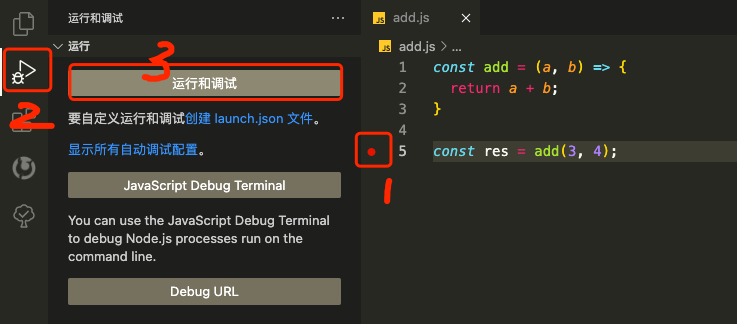
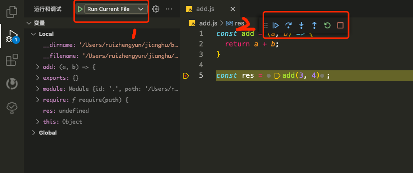
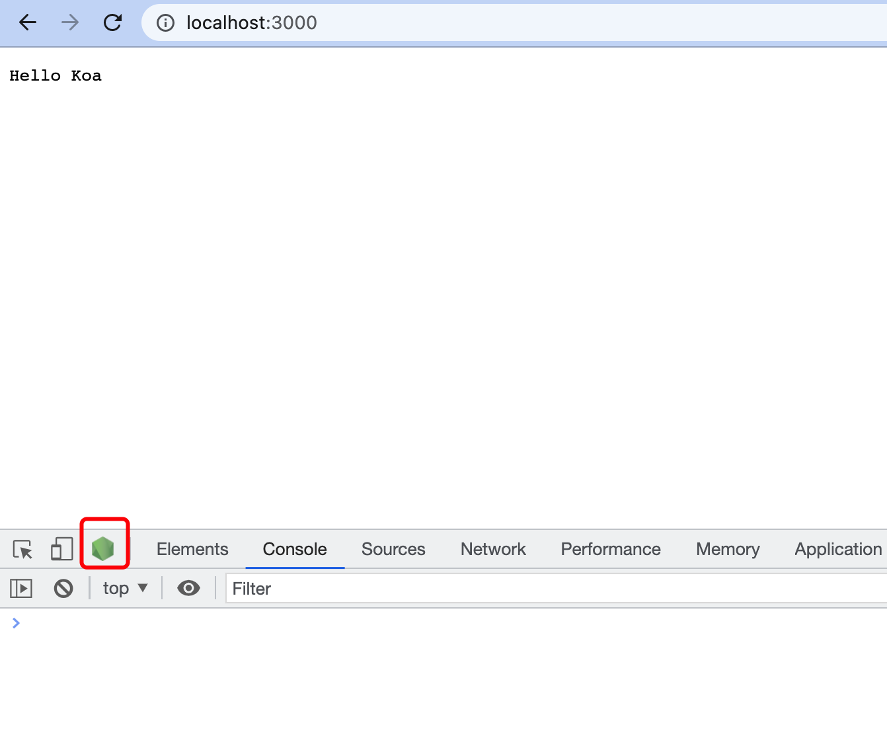
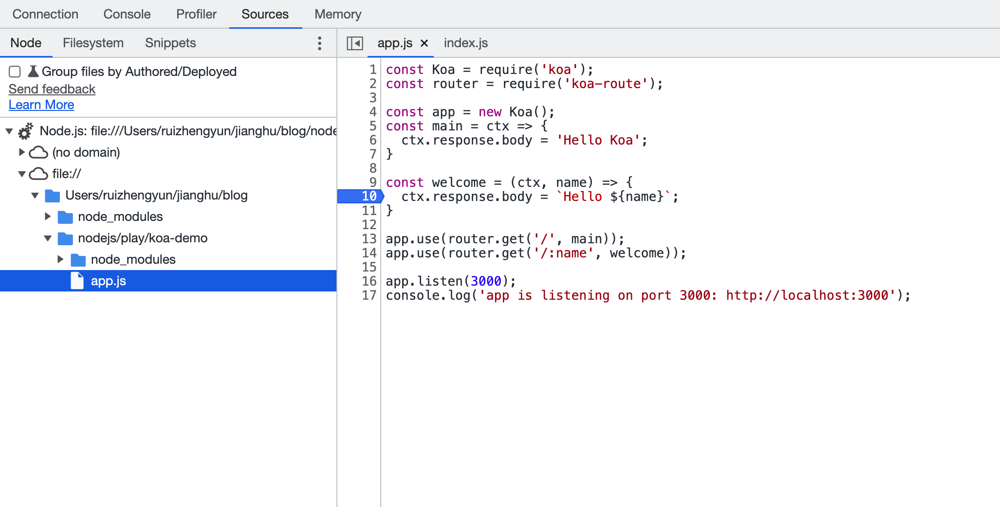
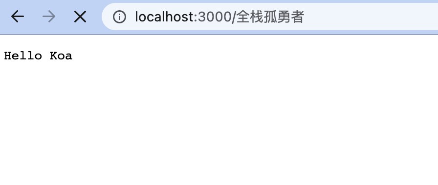
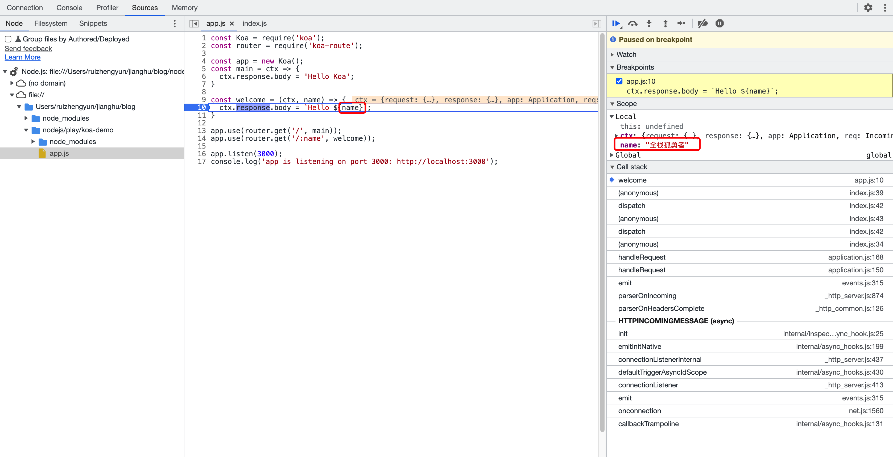
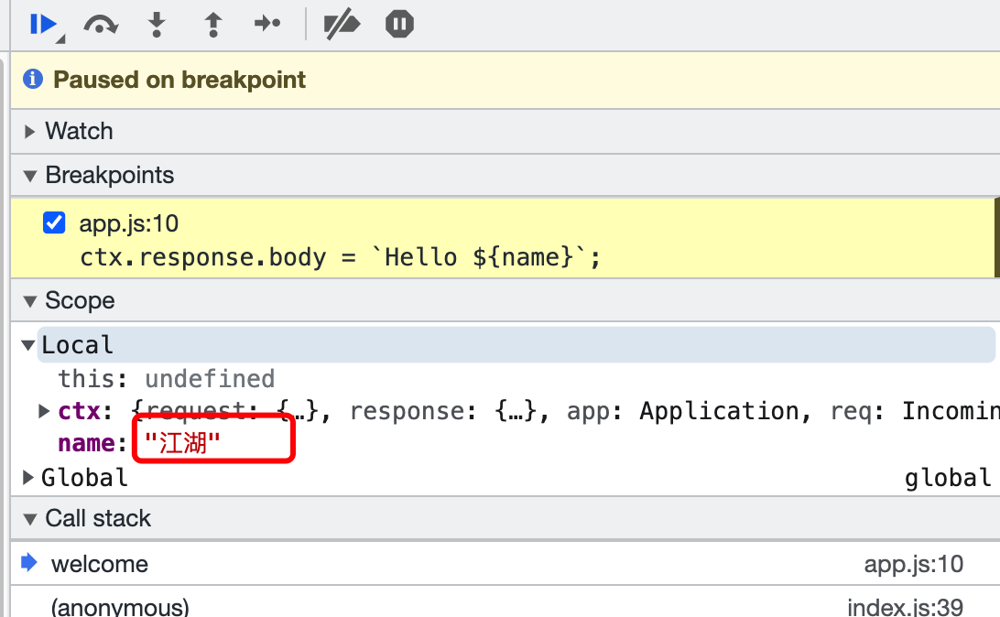
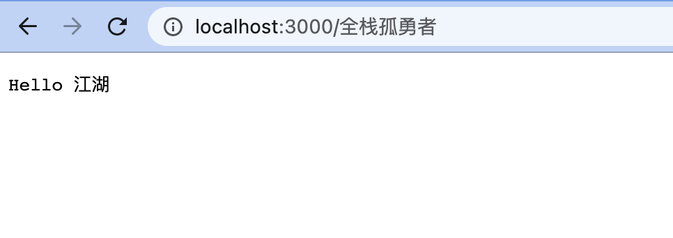
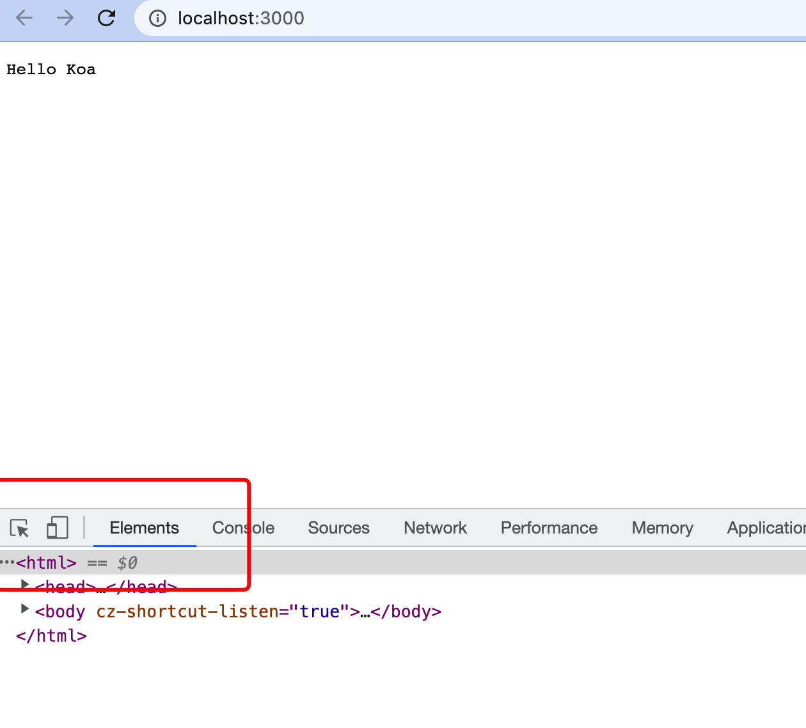

# 调试 Nodejs

## Run Current File

笔者喜欢使用 VS Code IDE，而 VS Code 内置 Nodejs 调试器，看下调试步骤吧。

1.创建文件夹 play，创建文件 add.js

```js
// play/add.js
const add = (a, b) => {
  return a + b;
}

const res = add(3, 4);
```

2.在工具栏找到 `Run and Debug（运行和调试）`按钮打开调试面板；




3.调试面板顶栏选择 `Run Current File`，点击左侧绿色执行按钮



## 调试项目

1.创建文件夹 koa-demo，安装依赖模块。

```sh
$ mkdir koa-demo && cd $_
$ npm init -y
$ npm i koa koa-route
```

2.新建一个脚本 `app.js`，做一个简单的 Web 应用，指定两个路由。

```js
// koa-demo/app.js
const Koa = require('koa');
const router = require('koa-route');

const app = new Koa();
const main = ctx => {
  ctx.response.body = 'Hello Koa';
}

const welcome = (ctx, name) => {
  ctx.response.body = `Hello ${name}`;
}

app.use(router.get('/', main));
app.use(router.get('/:name', welcome));

app.listen(3000);
console.log('app is listening on port 3000: http://localhost:3000');
```

3.启动开发者工具

启动项目

```sh
$ node --inspect app.js
```

注：`--inspect` 参数是启动调试模式必需的。

浏览器访问 `http://localhost:3000`，打开开发者工具，顶部左上角会有一个 Nodejs 绿色 LOGO 标识，点击进入。



浏览器会重新开个开发者工具的页签，我们可以在 `Source` 面板设置断点调试





修改 Local 作用域变量 name 的值为 `江湖`（原来为`全栈孤勇者`），然后执行调试工具栏上的继续运行按钮。你会发现本该显示 `Hello 全栈孤勇者`的，页面最终显示 `Hello 江湖`。





4.启动项目忘了加 --inspect

第 3 步启动项目写成 `$ node app.js`，浏览器访问 `http://localhost:3000`，打开开发者工具，顶部左上角没有 Nodejs 绿色 LOGO 标识。



除了重新启动项目还有什么办法？有的！

可以在另一个命令行窗口，查找上面脚本的进程号。

```sh
$ ps ax | grep app.js

65131 s005  S+     0:00.17 node app.js
65212 s006  S+     0:00.00 grep --color=auto
```

我们可运行下面命令，建立进程 65131 与调试工具的 ws 链接，就可以打开调试工具了（浏览器开发者工具顶部左上角的 Nodejs 绿色 LOGO 标识又出现了）。

```sh
$ node -e 'process._debugProcess(65131)'

# 或
$ kill -SIGUSR1 65131
```

## 参考

- [Node 调试工具入门教程](https://www.ruanyifeng.com/blog/2018/03/node-debugger.html)

