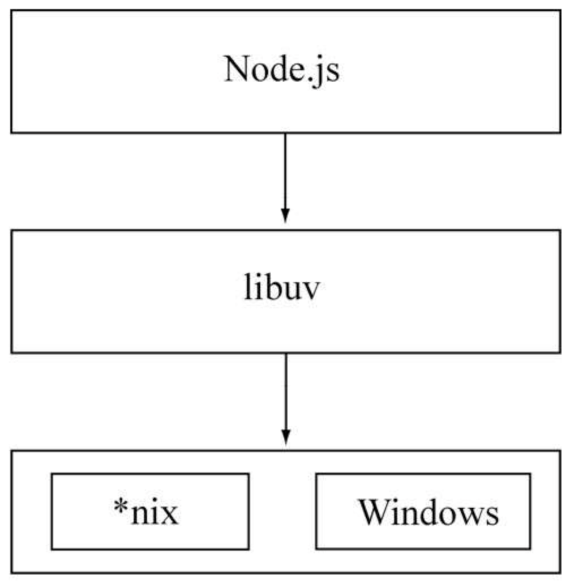

# Nodejs 常见问题

## 单线程的弱点

- 无法利用多核 CPU
- 错误会引起整个应用退出，应用的健壮性值得考验
- 大量计算占用 CPU 导致无法继续调用异步 I/O

解决方案：Node 采用了与 Web Workers 相同的思路（**child_process 子进程**）来解决单线程中大计算量的问题。

- **子进程**的出现，意味着 Node 可以从容地应对**无法利用多核 CPU 方面**和**单线程在健壮性**的问题。
- 通过**将计算分发到各个子进程，可以将大量计算分解掉**，然后再通过**进程之间的事件消息**来传递结果，这可以很好地保持应用模型的简单和低依赖。
- 通过 **Master-Worker** 的管理方式，也可以很好地管理各个工作进程，以达到更高的健壮性。

## 跨平台

起初，Node只可以在Linux平台上运行。如果想在Windows平台上学习和使用Node，则必须通过Cygwin或者MinGW。随着Node的发展，微软注意到了它的存在，并投入了一个团队帮助Node实现Windows平台的兼容，在v0.6.0版本发布时，Node已经能够直接在Windows平台上运行了。下图是 Node 基于 libuv 实现跨平台的架构示意图。

Node 基于 libuv 实现跨平台的架构示意图

## I/O 密集型

Node 利用事件循环的处理能力，而不是启动每一个线程为每一个请求服务，资源占用极少，这是其在 I/O 密集型处理上的优势。

## CPU 密集型

由于 JavaScript 单线程的原因，如果有长时间运行的计算（比如大循环），将会导致 CPU 时间片不能释放，使得后续 I/O 无法发起，这就是 Node 在 CPU 密集型应用上遇到的挑战。但是适当调整和分解大型运算任务为多个小任务，使得运算能够适时释放，不阻塞 I/O 调用的发起，这样既可同时享受到并行异步 I/O 的好处，又能充分利用 CPU。

Node 虽然没有提供多线程用于计算支持，但是还是有以下两个方式来充分利用 CPU。

- Node 可以通过编写 C/C++ 扩展的方式更高效地利用 CPU，将一些 V8 不能做到性能极致的地方通过 C/C++ 来实现。由上面的测试结果可以看到，通过 C/C++ 扩展的方式实现斐波那契数列计算，速度比 Java 还快。
- 如果单线程的 Node 不能满足需求，甚至用了 C/C++ 扩展后还觉得不够，那么通过子进程的方式，将一部分 Node 进程当做常驻服务进程用于计算，然后利用进程间的消息来传递结果，将计算与 I/O 分离，这样还能充分利用多 CPU。

所以，CPU 密集不可怕，**如何合理调度**是诀窍。