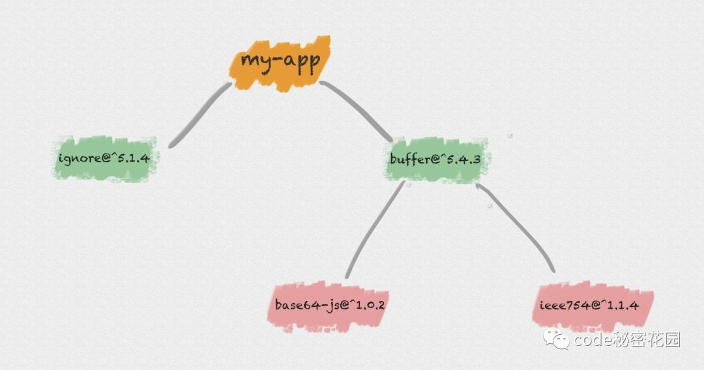

# npm install 原理分析

> 原文：https://cloud.tencent.com/developer/article/1555982
>
> 本文是基于原文加上自己的逻辑稍作调整


## 安装机制

> 执行 `npm install` 后，依赖包被安装到了 `node_modules` 中，那具体安装机制是什么？

### npm@3.x

在 `npm@3.x` 前，安装机制是以**递归**方式，严格按照 `package.json` 结构以及子依赖包的 `package.json` 结构将依赖安装到他们各自的 `node_modules` 中，直到有子依赖包不在依赖其他模块。

特性**简单粗暴**。

举例：应用 `my-app` 依赖了两个模块：`buffer` 和 `ignore`：

```json
{
  "name": "my-app",
  "dependencies": {
    "buffer": "^5.4.3",
    "ignore": "^5.1.4",
  }
}
```

- `ignore` 是一个纯 JS 模块，不依赖任何其他模块。
- `buffer` 依赖了下面两个模块：`base64-js` 和 `ieee754`。

```json
{
  "name": "buffer",
  "dependencies": {
    "base64-js": "^1.0.2",
    "ieee754": "^1.1.4"
  }
}
```

那么，执行 `npm install` 后，得到的 `node_modules` 中模块目录结构就是下面这样的：




- 优点：`node_modules` 的结构和 `package.json` 结构一一对应，层级结构明显，并且保证了每次安装目录结构都是相同的。
- 缺点：依赖的模块多，`node_modules` 就变庞大，嵌套层级就变深。