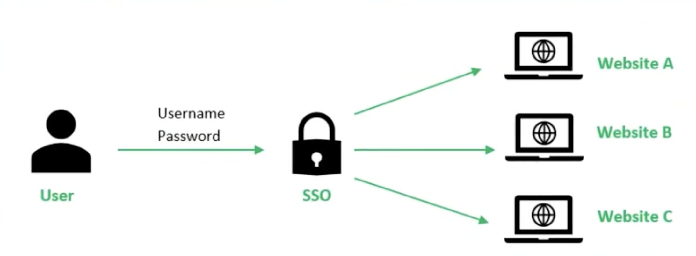

# 单点登录

产品发展初期，可能只需要一个系统就能满足用户使用账号和密码的验证登录需求。随着业务迭代，系统架构也会迭代升级，演变为多个子系统，用户每进入一个子系统都要重新登录（验证身份）， 才有权限进行行为 操作。为了解决这一痛点，**单点登录** 应运而生。

单点登录，英文名称 Single Sign On，简写 SSO，是通过用户的一次性鉴别登录，即在一个多子系统共存的环境下，用户只要在任何一个子系统登录以后，就获得其他子系统的信任，也就不用在其他子系统再次登录。所以，单点登录是一种身份验证的解决方案，可以让用户在`身份认证服务器`上登录一次以后，即可获得访问`单点登录系统`中其他`关联系统`和`应用软件`的`权限`，同时这种实现是不需要管理员对用户的登录状态或其他信息进行修改的，这意味着在多个应用系统中，用户只需一次登录就可以访问所有相互信任的应用系统。这种方式减少了由登录产生的时间消耗，辅助了用户管理，是目前比较流行的。

下图是传统的登录流程：

## SSO 标准协议

OAuth2.0
OpenID Connect

## 参考

- [单点登录（SSO）看这一篇就够了](https://developer.aliyun.com/article/636281)