# 程序员常逛的技术社区

## 社区

### [dev.to](https://dev.to/)
`dev.to` 是一个充满活力的开发者在线平台和社区。它拥有超过 1,199,008 名会员，是开发人员分享知识、参与讨论并了解科技行业最新趋势的空间。该平台涵盖广泛的主题，包括编程语言、框架、工具和最佳实践。开发人员可以发布文章、教程和见解，营造一个有利于学习和职业发展的协作环境。无论您是初学者还是经验丰富的开发人员，DEV 社区都提供了一个支持空间，可以与同行交流并提高您的编码技能。

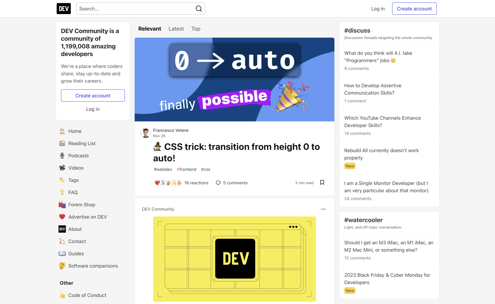

### [Stack Overflow](https://stackoverflow.com/questions)
`Stack Overflow` 是一个流行的在线平台，开发人员可以在这里询问和回答与编程相关的问题。它是程序员寻求帮助、分享知识和解决编码问题的协作社区。用户可以发布问题、提供答案并参与各种编程主题的讨论。该平台涵盖了各种编程语言、框架和技术，使其成为初学者和经验丰富的开发人员的宝贵资源。

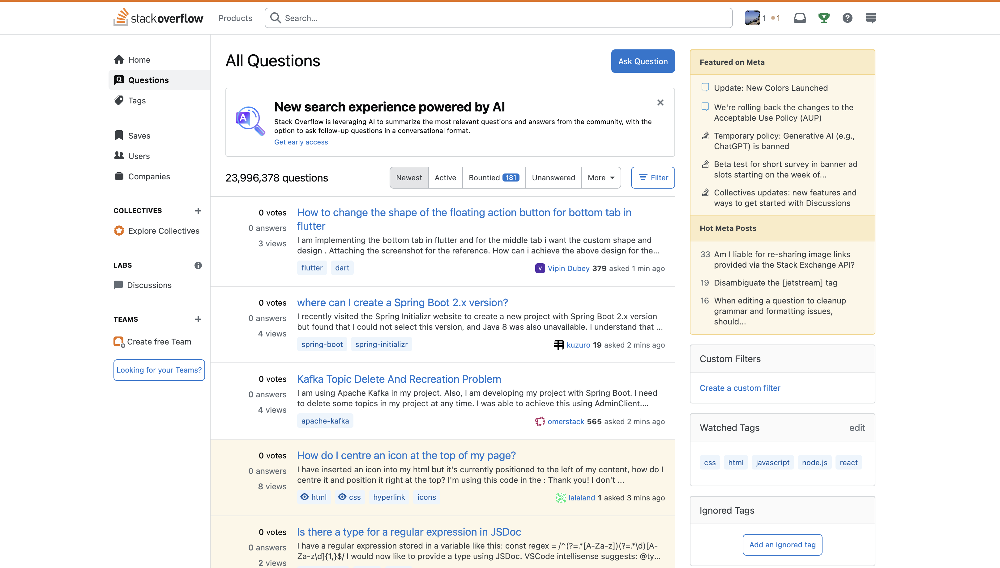

### [Google Developers](https://developers.google.com/?hl=zh-cn)
`Google Developers` 是一个提供资源、社区活动和励志故事的综合平台，支持开发者跨人工智能、移动开发、Web 开发和云计算等各个领域构建智能解决方案并加速项目交付。该平台涵盖广泛的技术和工具，使开发人员能够创建创新的应用程序和服务。

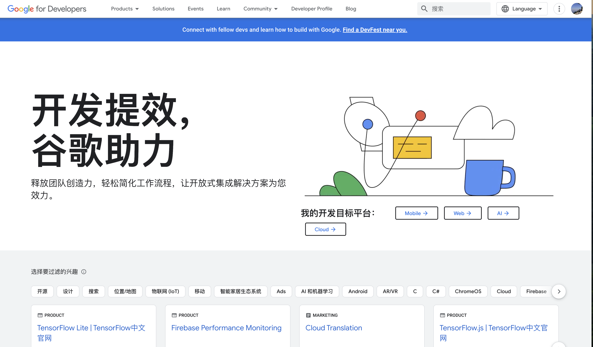

### [Bytes](https://bytes.com/)
Bytes 是一个在线社区和平台，为开发人员、程序员和IT专业人士提供了一个空间，以连接、分享知识，并在与编程和技术相关的各种主题上寻求帮助。该平台提供了覆盖广泛的编程语言、软件开发和IT相关问题的论坛和讨论。会员可以参与交流、提出问题，并为社区贡献自己的专业知识。Bytes.com作为一个协作环境，让个人可以找到问题的解决方案，了解行业趋势，并与志同道合的技术专业人士联系。

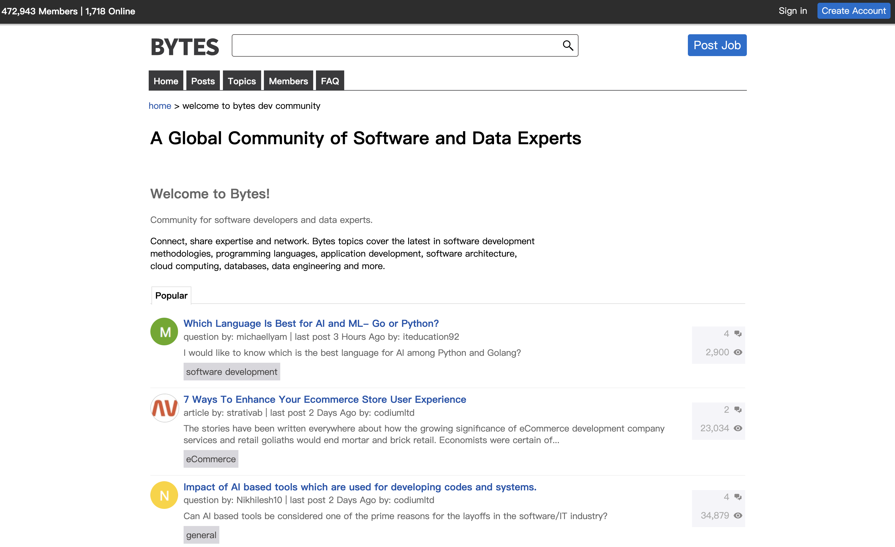

### [Substack](https://ratrey.substack.com/)
`Substack`是一家美国在线平台，革新了数字出版业。它提供了独特的功能组合，允许个人创建自己的出版物，包括个人网站、博客、电子邮件通讯或播客。该平台简化了这一过程，使任何人都能快速轻松地与更广泛的受众分享他们的内容。Substack提供必要的基础设施，包括出版工具、支付系统、分析和设计支持，以促进基于订阅的通讯。这种创新的方法赋予了作家和内容创作者权力，使他们能够围绕自己的工作建立社区，并有可能实现货币化。Substack专注于培育优秀的写作，已引起关注，并成为在线媒体和通讯领域中的重要参与者。

### [V2ex](https://v2ex.com/)  
`V2EX` 是一个基于开源社区理念的网站，主要提供 IT 技术分享交流。V2EX 是一个基于开源社区理念的网站，主要提供 IT 技术分享交流。V2EX 是一个基于开源社区理念的网站，主要提供 IT 技术分享交流。

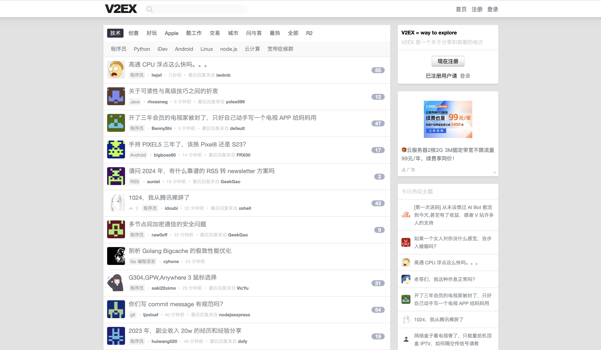

## 资料

### [Simpleprogrammer](https://simpleprogrammer.com/)
`Simple Programmer` 是一个技术博客和培训网站，旨在帮助软件开发人员和IT专业人员提高他们的技能和职业发展。该网站提供了丰富的内容，涵盖了面试准备、编码问题、职业发展、软技能等多个方面。

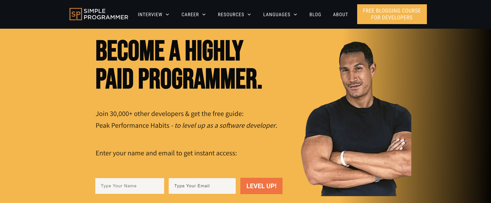

### [Tutorialspoint](https://www.tutorialspoint.com/index.htm)
`Tutorialspoint` 是一个在线学习平台，提供免费教程、付费高级课程和电子书。该平台涵盖了多种技术和编程语言，包括 `Java`、`Objective-C`、计算机编程、`HTTP` 等。它的目的是帮助学习者掌握最新的技术和编程知识。

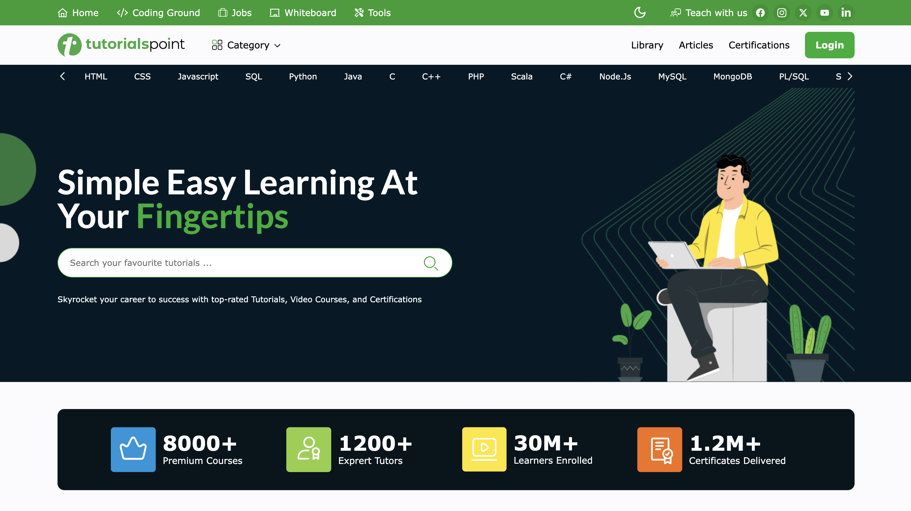

### [Sitepoint](https://www.sitepoint.com/web/)
`SitePoint` 是一个在线社区，主要以 `web` 开发和设计、文章撰写以及用户体验为主。它的目标是帮助初学者更好地了解其选择的编程语言和技术，并提高相应的水平。该网站提供高质量的内容，涵盖前端、移动端等技术领域，以及问答社区，为开发者提供学习、成功和超越自我的机会。

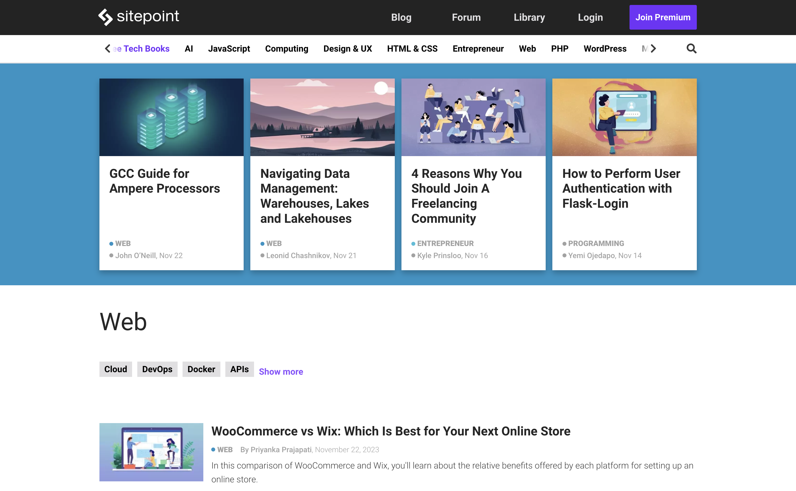

### [Dzone](https://dzone.com/)
Dzone 是一个著名的在线社区和领先的知识资源出版商，致力于软件工程专业人士。 DZone 拥有超过 100 万会员，为编程、Web 开发和 DevOps 爱好者提供了一个平台。它为从初学者到该领域专家的个人提供了丰富的资源，包括新闻、教程和工具。该平台涵盖各种主题，包括 Java 资源等专门区域和 DevSecOps 等主题的内容。 DZone 致力于培育学习和协作社区，这使其成为了解行业趋势和扩展专业知识的宝贵资源。

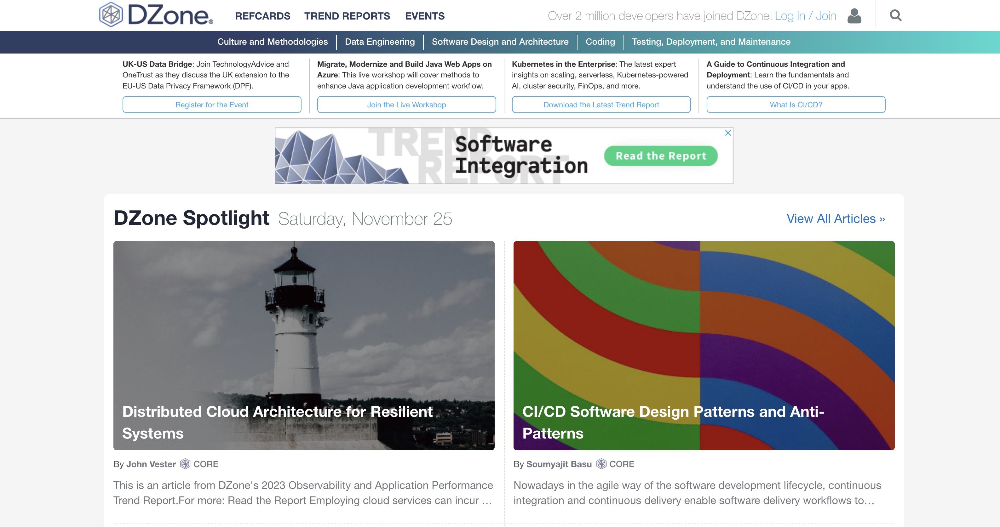

### [少数派](https://sspai.com/)
`少数派` 是一个以科技、设计、产品、生活等科技类内容为主的社区，致力于为用户提供有价值的内容。少数派致力于为用户提供有价值的内容，并帮助用户发现有价值的内容。少数派是一个以科技、设计、产品、生活等科技类内容为主的社区，致力于为用户提供有价值的内容。少数派致力于为用户提供有价值的内容，并帮助用户发现有价值的内容。

## 博客

### [阮一峰的网络日志](https://www.ruanyifeng.com/blog/)
`Ruanyifeng's Blog` 是阮一峰的个人博客，他是一位知名的程序员、作家和技术博主。博客内容涵盖了广泛的技术主题，包括编程、Web开发、计算机科学等。阮一峰以深入浅出的风格，向读者分享技术经验、观点和见解。博客内容丰富，适合程序员和对技术感兴趣的人学习和探讨。

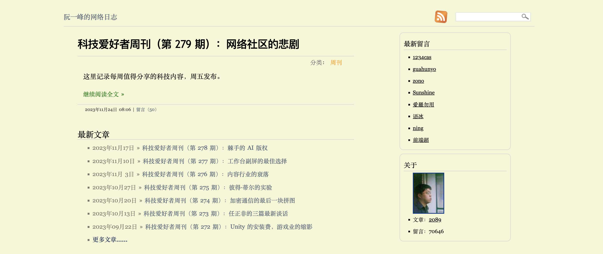

## 职场

### [Vadimkravcenko](https://vadimkravcenko.com/)   
Vadim Kravcenko 是一个提供有价值的见解和指南的平台，特别关注初创公司创始人和软件工程师。内容涵盖的主题包括 CTO 正确文档的力量、初创公司创始人的指南、优秀软件工程师的习惯、成为开发人员的好导师，以及处理软件开发中的失败和事后分析等。该平台似乎为科技行业的个人（尤其是初创环境中的个人）提供了丰富的知识和实用建议。如需更深入的信息，探索网站上的各种指南和短片将是有益的。

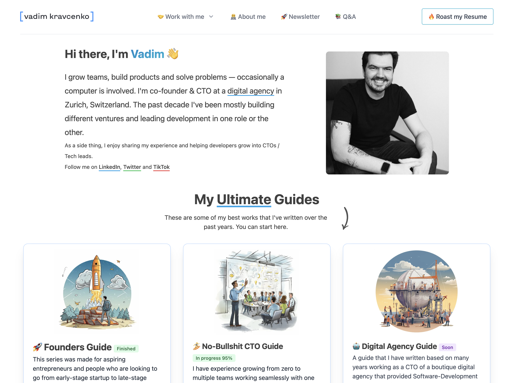