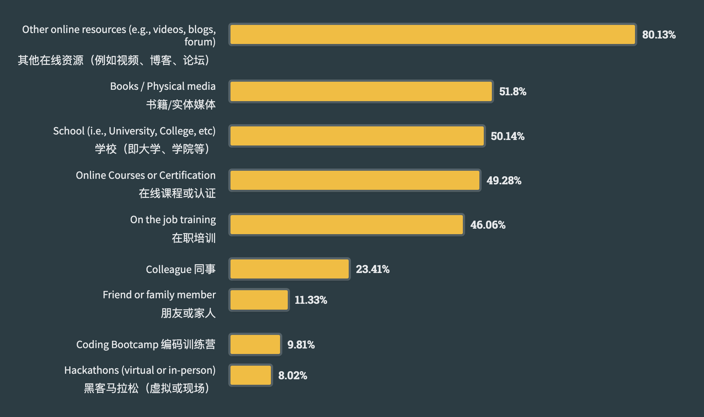
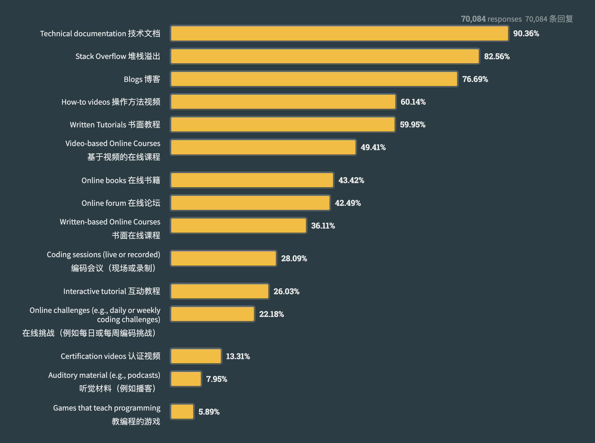
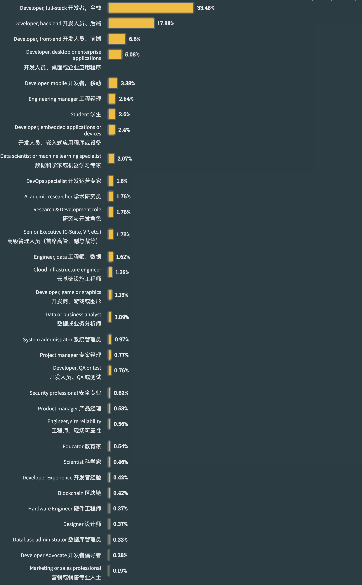
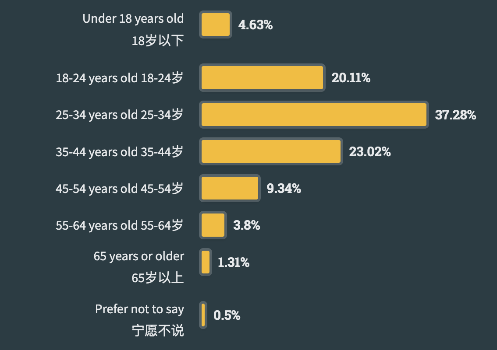
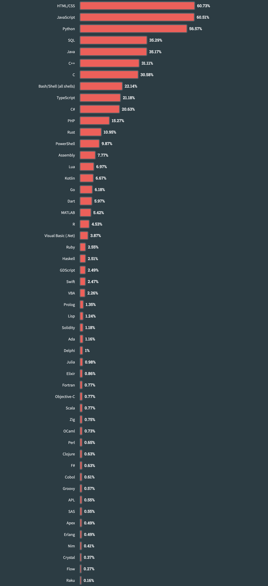
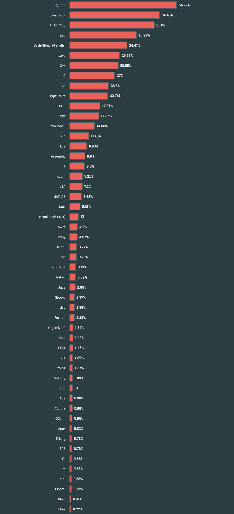
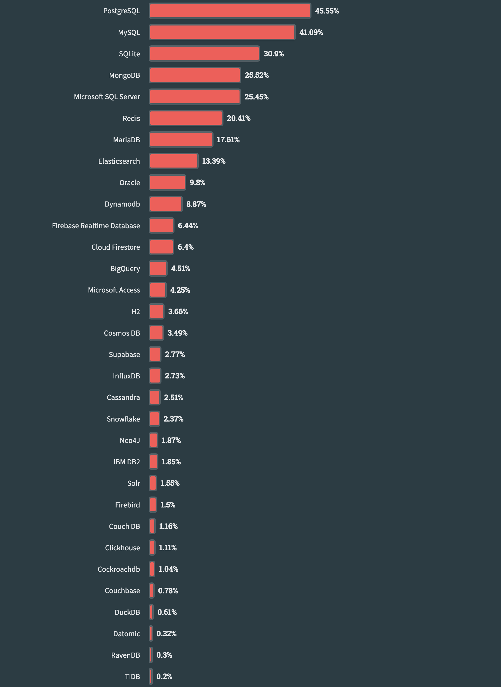
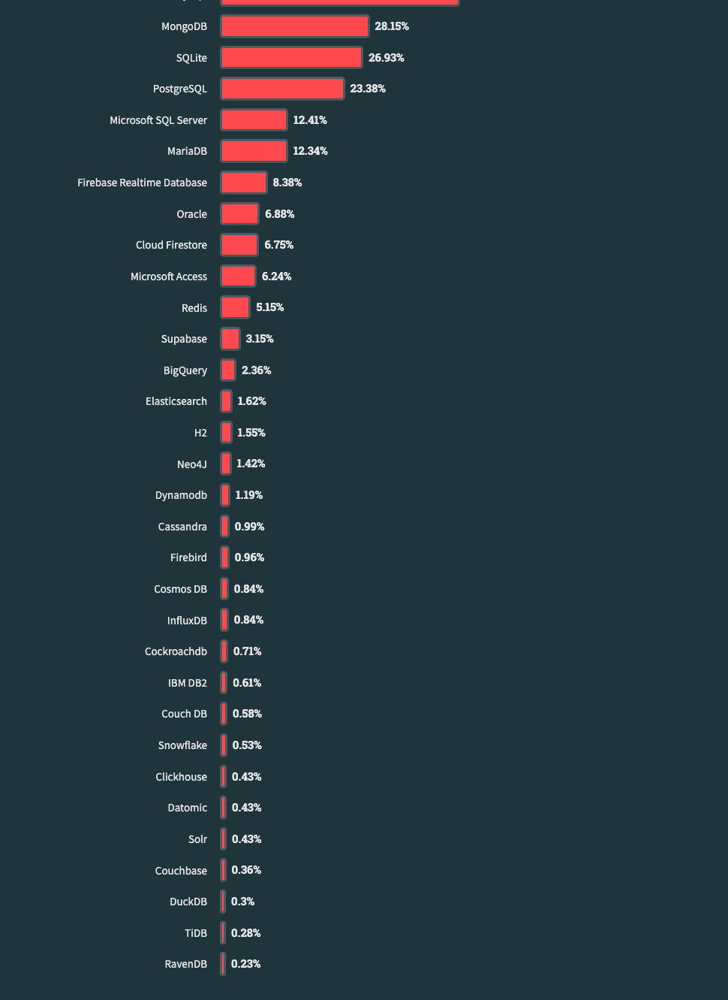

# 2023年 Stack Overflow 开发者调查

> 发布时间：2023年5月
> 
> 数据来自：[https://survey.stackoverflow.co/2023/](https://survey.stackoverflow.co/2023/)

以下是2023年开发者调查，调查内容是**结和国内现状以及笔者感兴趣的内容**来裁剪的。

自2010年来，Stack Overflow 已经提供了13年有关开发者社区的行业领先的见解。

## 1 开发者

### 1.1 如何学习编码

自 2022 年调查以来，通过**在线资源**学习编码的比例从 70% 增加到 80%。

- 18 岁及以下的受访者是最常选择在线资源（例如视频、博客、论坛）进行学习的人群； 
- 25 - 34 岁的受访者是从在线课程或认证中学习的最多的年龄段 (52%)；
- 仍然从传统学校学到更多 (55%)；

#### 1.1.1 如何通过在线资源学习编码

与前几年一样，**技术文档**和 **Stack Overflow** 是人们学习编码时最常用的在线资源，**博客**也位列前三。

编写良好的**文档**、提供解决方案的**活跃社区**以及定期发布的**帖子**是使人们能够自学技术的三要素。

开发人员看到了各种其他资源的价值，例如操作视频、书面教程、书籍、论坛，他们将最适合其学习风格的资源和格式组合在一起。

### 1.2 经验

大多数开发人员处于职业生涯的早期到中期阶段。

#### 1.2.1 按开发人员类型划分的多年专业编码经验

高级管理人员的专业编码经验平均年数最高 (17.4)，其次是桌面或企业应用程序开发人员 (16.4) 和教育工作者 (15.8)。

### 1.4 人口统计

今年我们减少了人口统计问题的数量，只询问年龄。

#### 1.4.1 年龄

43% 的专业开发人员年龄在 25-34 岁之间。但我们发现，超过一半学习编程的受访者年龄在 18-24 岁之间。

## 2 技术

每年我们都会探索开发人员当前正在使用以及他们想要使用的工具和技术。今年，我们纳入了有关人工智能工具的新问题。我们还引入了一种新的方式来看待“共事者”与“想要共事者”之间的关系，称之为“钦佩”和“渴望”。

### 2.1 最流行的技术

今年，我们比较了三个不同群体的流行技术：所有受访者、专业开发人员和正在学习编码的人。

#### 2.1.1 编程、脚本和标记语言

2023 年，JavaScript 连续第11年成为最常用的编程语言。

Python 已取代 SQL 成为第三大最常用语言，但对于那些非专业开发人员或学习编码的人（其他编码人员）来说，排名第一。

今年，有一些技术上升了一位（Bash/Shell、C、Ruby、Perl 和 Erlang），有两种技术上升了两位（Elixir 和 Lisp）。

自 2022 年以来，最大的推动者是 Lua，一种嵌入式脚本语言，自 2022 年以来上升了 7 位。

专业开发者排名前三的技术与去年相同——JavaScript、HTML/CSS 和 SQL。但对于那些学习编码的人来说，情况就不同了。 HTML/CSS 和 JavaScript 几乎并列成为学习编码的人最流行的语言。学生开发

人员使用 Python 的比例多于 SQL（59% 对 37%），而专业开发人员报告使用 SQL 的比例多于 Python（52% 对 45%）。

与专业开发人员相比，学习编码的人更有可能使用 Java（37% vs 31%）、C++（32% vs 20%）和 C（32% vs 17%）。

##### 2.1.1.1 所有者

##### 2.1.1.2 专业开发者

##### 2.1.1.3 学习编码

##### 2.1.1.4 其他编码

#### 2.1.2 数据库

今年，PostgreSQL 从 MySQL 手中接过了第一名的位置。

专业开发人员比学习编码的人更有可能使用 PostgreSQL (50%)，而学习编码的人更有可能使用 MySQL (54%)。

专业开发人员和学习编码的人使用 MongoDB 的比例相似，对于学习编码的人来说，它是第二受欢迎的数据库（仅次于 MySQL）。

##### 2.1.2.2 所有者

##### 2.1.2.3 专业开发者

##### 2.1.2.3 学习编码

##### 2.1.2.4 其他编码

#### 2.1.3 框架和技术

Node.js 和 React.js 是所有受访者最常用的两种 Web 技术。

专业开发人员相当平等地使用 Node.js，而学习编码的人则更多地使用 Node.js，而不是 React（52% vs. 48%）。 

jQuery 和 Express 是对所有受访者来说接下来的两种流行的 Web 技术，专业开发人员比学习编码的人更多地使用 jQuery（24% 对 18%），而学习者比专业开发人员更多地使用 Express（25% 对 18%）。 20%）。 

Next.js 从 2022 年的第 11 位上升到今年的第 6 位，这可能是因为它在学习编码的人中很受欢迎。

##### 2.1.3.2 所有者

<!-- 

##### 2.1.3.3 专业开发者

<!-- 

##### 2.1.3.3 学习编码

<!-- 

##### 2.1.3.4 其他编码

<!-- 

[了解更多->](https://insights.stackoverflow.com/survey)