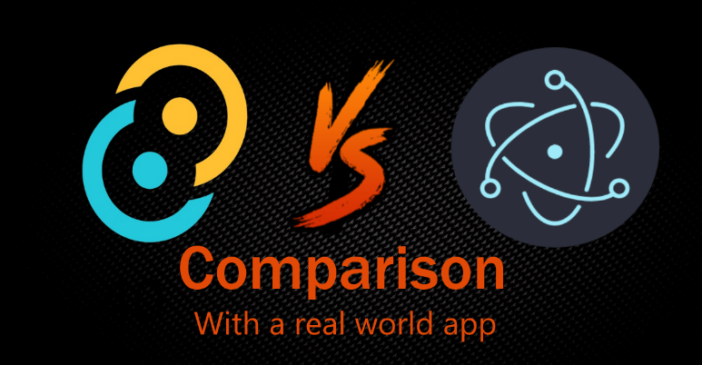

# Tauri vs Electron：真实项目的比较（译文）

> 原文: https://www.levminer.com/blog/tauri-vs-electron

Electron 是目前跨平台桌面软件的首选开发框架，Tauri 则是最近出现的一个替代品，试图解决前者的最大痛点：体积臃肿，资源占用高。

作者特意用 Tauri 写了一个桌面应用。本文是他的使用感受，以及两者的全方位比较。