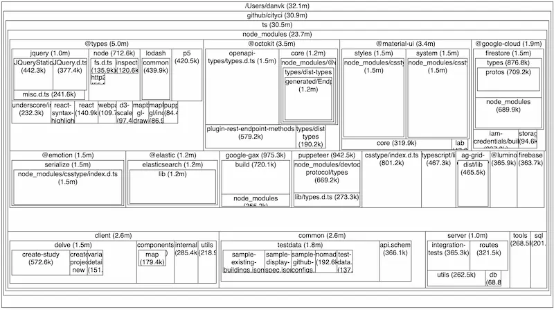

# 如何提高 TypeScript 编译速度

> 原文：[https://effectivetypescript.com/2022/07/30/treemap-for-source-files/](https://effectivetypescript.com/2022/07/30/treemap-for-source-files/)

大型 TypeScript 项目的编译速度，通常是很慢的。作者介绍了一个技巧，通过 webtreemap 找出速度瓶颈在哪里。
