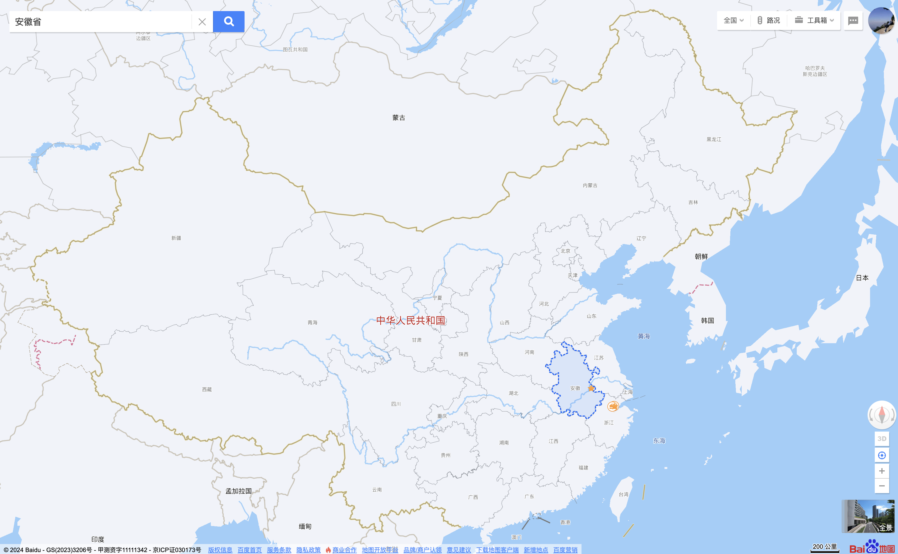
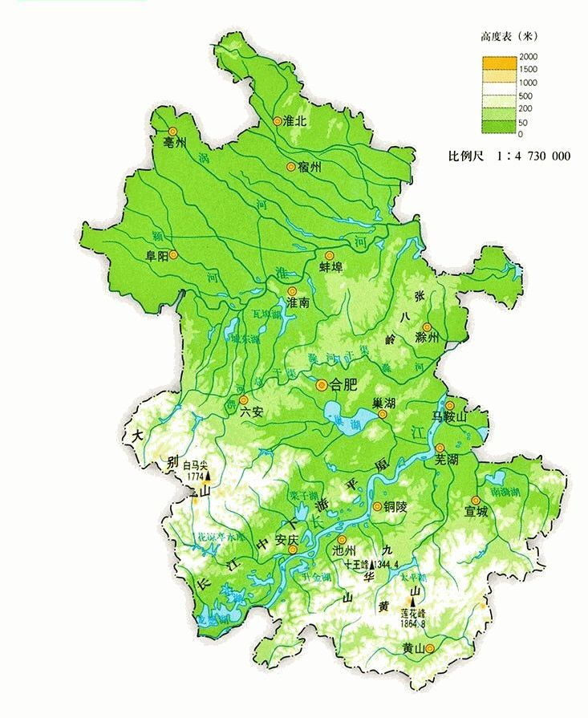

# 周刊（第 2 期）：解决方案

> 作者：[江湖](../about.md)
> 
> 日期：2024年1月8日
>
> 这里记录每周值得分享的兴趣内容，周一发布。
>
> 本周刊[开源](https://github.com/fullstackren/fullstackren.github.io/tree/main/weekly)，欢迎[投稿](https://github.com/fullstackren/fullstackren.github.io/issues)。合作请<a href="mailto:ruizhengyun@gmail.com" target="_blank">邮件联系</a>（ruizhengyun@gmail.com）。

## 解决方案

## 源码解读

## 实战

## 文章

## 工具

## 资源

## 热点话题

## 地理

安徽是我的故乡，所以她就是开篇作。

安徽位于长江中下游平原，平原是个好地方，能种很多粮食，交通也方便。西部有一部分是大别山，南部是黄山山脉及其余脉黄山、九华山、齐云山、天目山。 

由于山里面不好种粮食，为了活命就有很多人出去做生意，将做生意赚来的钱用来修祠堂祖宅，比如黄山黟县古村落，村子的通济桥还是南宋时建的。

决定安徽命运的两条河流，一个是淮河，一个是长江。

## 影视

## 心得

## 趣闻

1、投流，是流媒体技术中的一个概念，是指通过花钱将流媒体内容传输到目标受众的特定位置，以便他们可以观看，进而产生购买行为。本质上就是通过增加人流量，提高商品销量。对于平台来说，投流是一种商业化的行为，对于品牌商来说，投流是一种营销策略。投流影响的是购买。

2、种草，是有一些品牌，你看到后可能不会立刻下单，但你因为看到别人的分享，对这个品牌产生了信任，它影响了你的心智。等你需要的时候，你会第一时间想到它。种草影响的是心智。

（完，祝好！）

:::tip 文档信息
版权声明：自由转载-非商用-非衍生-保持署名（创意共享3.0许可证） 
发表日期： 2024年1月8日
:::