# 周刊/第 8 期：前端 UI 框架选型

> 作者：[江湖](../about.md)
> 
> 日期：2024年2月19日
>
> 这里记录每周值得分享的兴趣内容，周一发布。
>
> 本周刊[开源](https://github.com/fullstackren/fullstackren.github.io/tree/main/weekly)，欢迎[投稿](https://github.com/fullstackren/fullstackren.github.io/issues)。合作请<a href="mailto:ruizhengyun@gmail.com" target="_blank">邮件联系</a>（ruizhengyun@gmail.com）。

## 前端UI框架选型

前端 UI 框架是一种基于 HTML、CSS、JavaScript 等前端技术的开发工具集，提供了一系列的 UI 组件、样式、布局等基础功能，使得前端开发人员可以更加高效地开发出具有良好用户体验的 Web 应用，同时也能够保证 Web 应用的视觉效果和交互体验的一致性。

1、[Ant Design](https://ant-design.antgroup.com/index-cn)是由阿里巴巴蚂蚁金服前端团队基于 React 制作的 Web 应用程序 UI 组件库，[点击查看源码](https://github.com/ant-design/ant-design)。

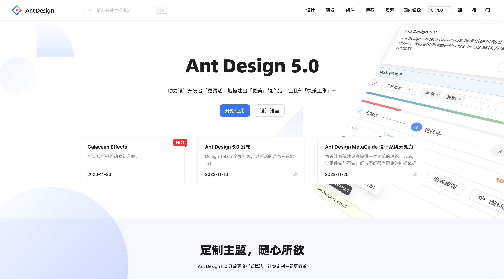

2、[Element Plus](https://element-plus.gitee.io/zh-CN/) 是由饿了么团队基于 Vue.js@3 制作的 Web 应用程序 UI 库，[点击查看源码](https://github.com/element-plus/element-plus)。

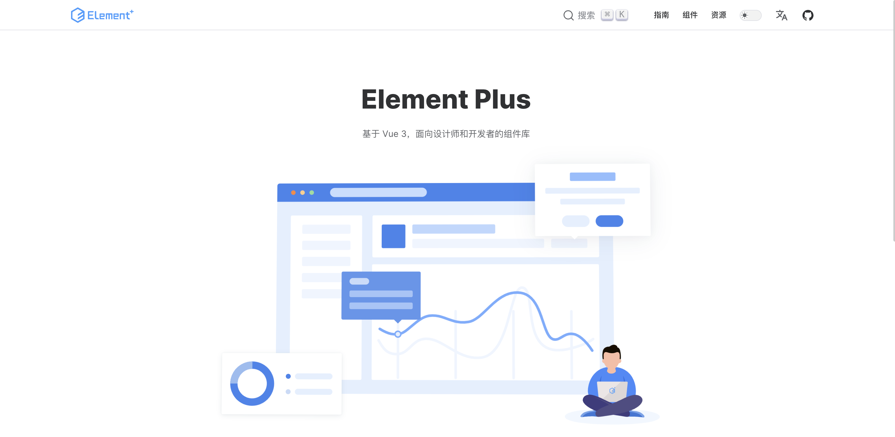

3、[Ant Design Vue](https://antdv.com)是一个基于 Ant Design 和 Vue 制作的 Web 应用程序 UI 组件库，[点击查看源码](https://github.com/vueComponent/ant-design-vue)。

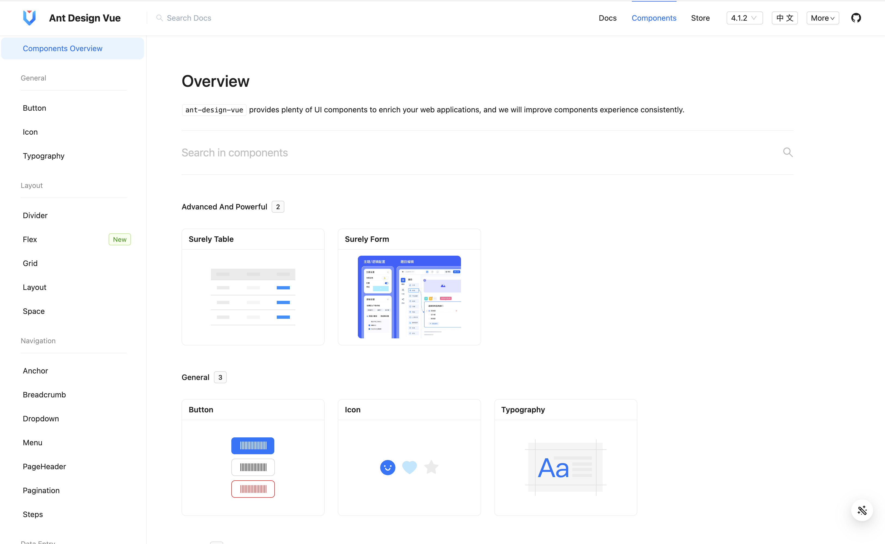

4、[Semi Design](https://semi.design/zh-CN/)由抖音前端与 UED 团队基于 React 制作的 Web 应用程序 UI 组件库，易于定制的现代化设计系统，帮助设计师与开发者打造高质量产品，[点击查看源码](https://github.com/DouyinFE/semi-design)。

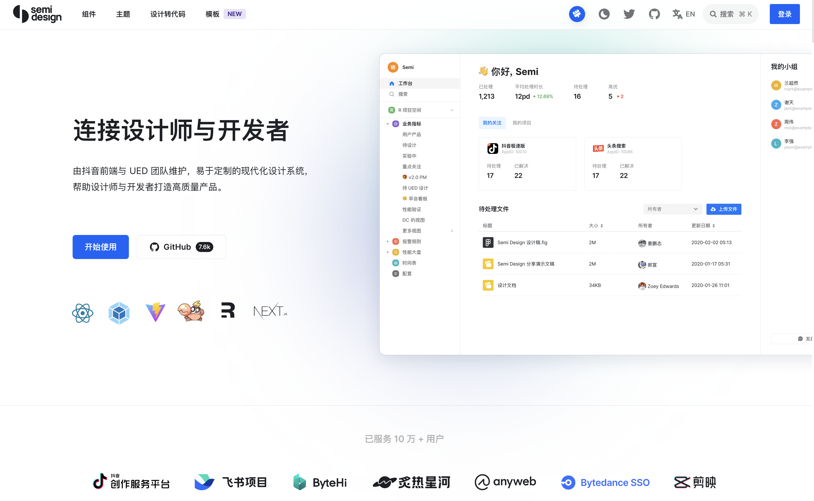

5、[Naive UI](https://www.naiveui.com)是一个基于 Vue.js@3 制作的 Web 应用程序 UI 组件库，[点击查看源码](https://github.com/tusen-ai/naive-ui)。

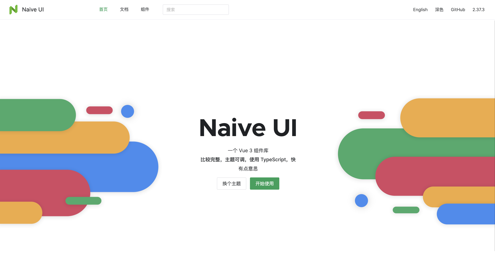

6、[View Design](https://www.iviewui.com/) 是基于 Vue.js@3 制作的 Web 应用程序 UI 组件库，[点击查看源码](https://github.com/view-design/ViewUIPlus)。

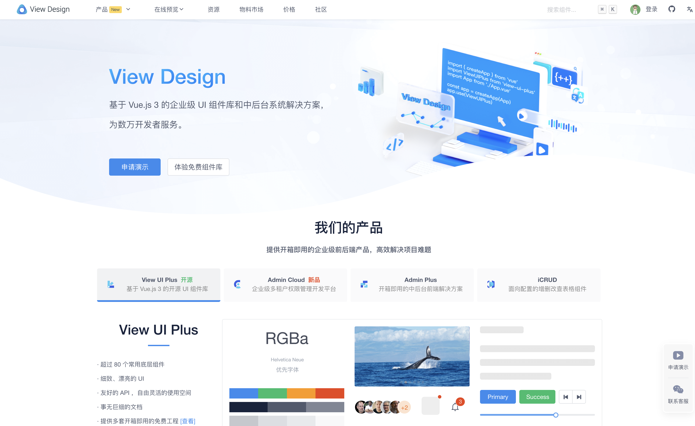

7、[Layui Vue](http://www.layui-vue.com/zh-CN/index)是一个基于 Layui 和 Vue.js@3 开发的 Web 应用程序 UI 组件库，[点击查看源码](https://github.com/layui-vue/layui-vue)。

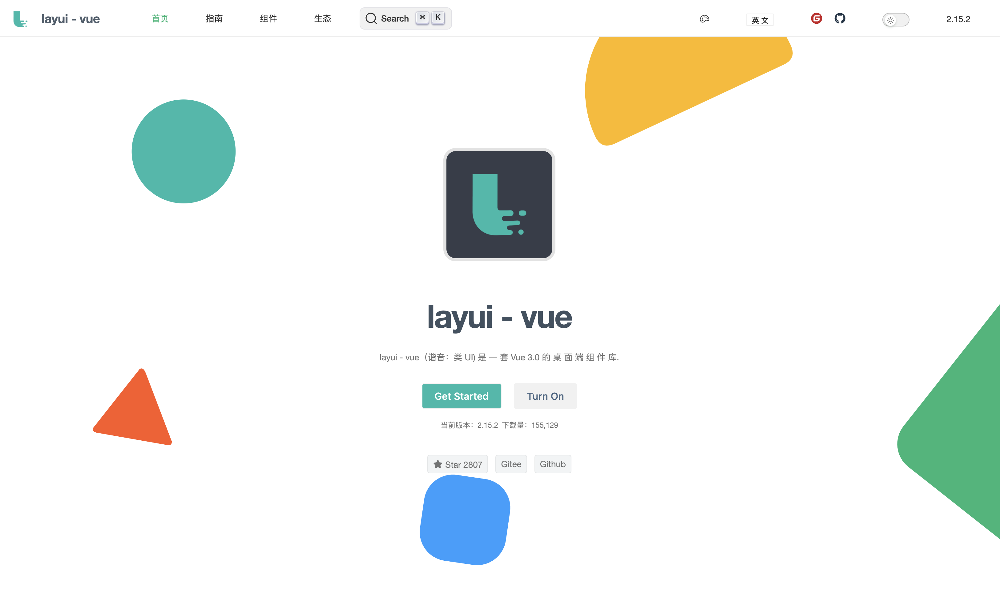

8、[Layui](https://layui.dev/) 是一套遵循原生态开发模式制作的 Web 应用程序 UI 组件库，[点击查看源码](https://github.com/layui/layui)。

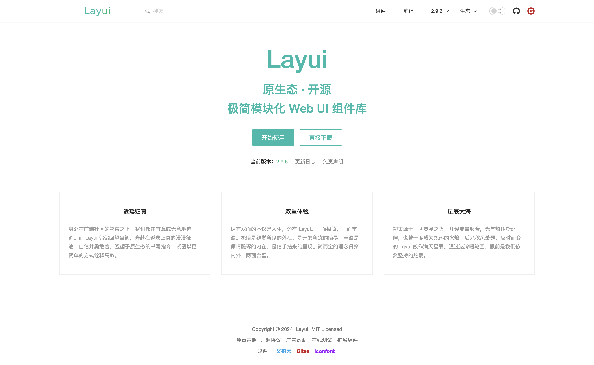

9、[Bootstrap](https://www.bootcss.com/) 是由 Twitter 团队开发的一款基于 HTML、CSS 和 JavaScript 制作的 Web 应用程序 UI 组件库，[点击查看源码](https://github.com/twbs/bootstrap)。

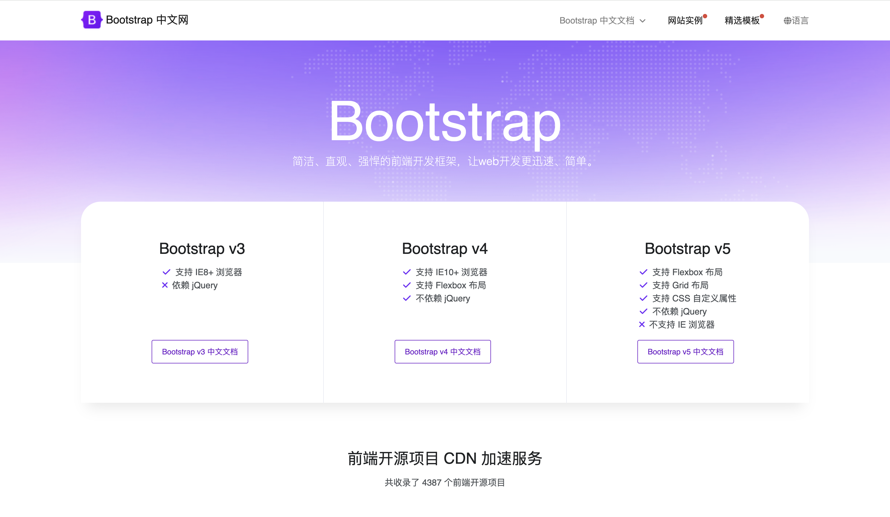

10、[Vant](https://vant-ui.github.io/vant/#/zh-CN) 是有赞团队基于 Vue.js@3 制作的移动 Web 应用程序 UI 组件库，[点击查看源码](https://github.com/youzan/vant)。

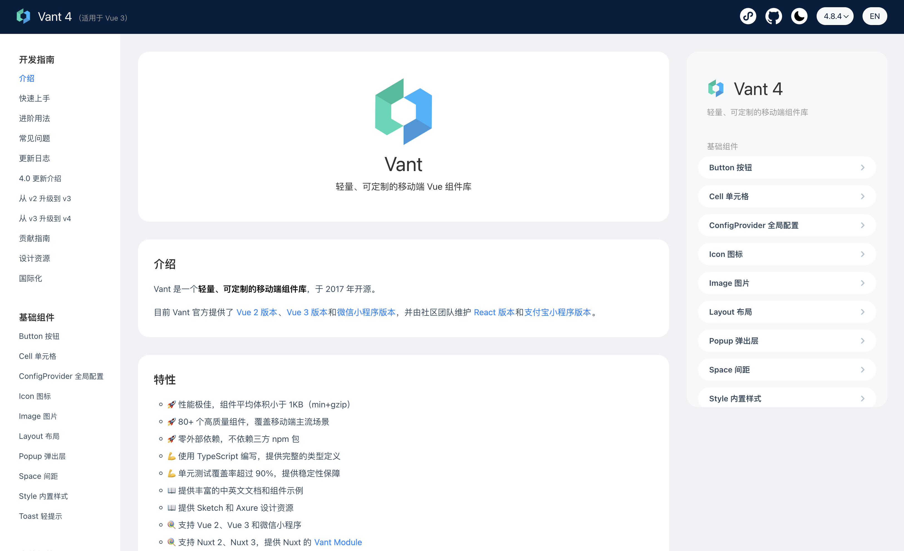

11、[Weui](https://weui.io/) 是微信官方团队基于微信原生视觉体验而设计的一款微信应用 UI 组件库，[点击查看源码](https://github.com/Tencent/weui)。

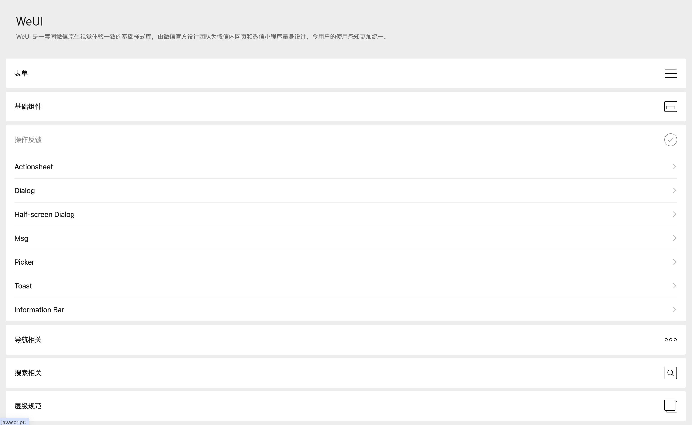

12、[Taro](https://www.taro.zone/) 是一套遵循 React 语法规范的多端统一开发框架，[点击查看源码](https://github.com/NervJS/taro)。

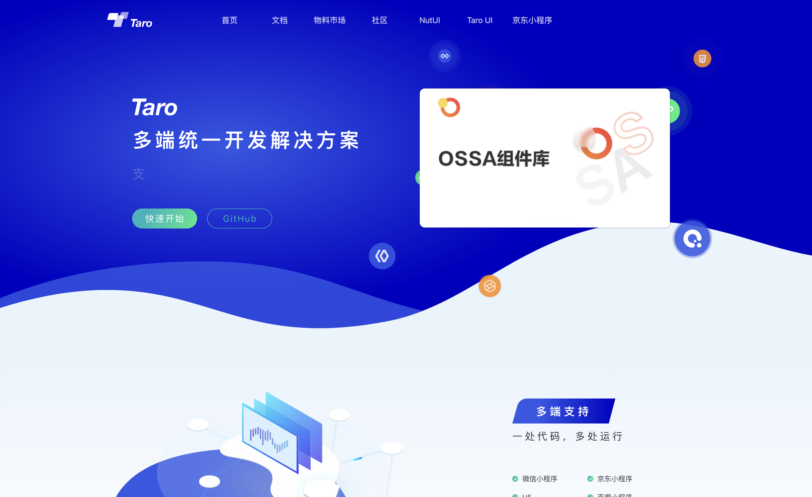

## 源码解读

## 实战

## 文章

## 工具

## 资源

## 热点话题

## 旅游

## 影视

## 心得

## 趣闻

1、妻子带娃去电影院看电影《热辣滚烫》，中途娃觉得不好看，就说：“妈妈，这个不好看，遥控器在哪，我要换个看看”。小孩子的世界是简单的，他们只关心眼前的事情，不会去想其他的事情。

2、广播中听到主持人说有的地方“四季如春”，而杭州当下是“春如四季”，今天杭州温度15~26℃，大家着装各不相同。

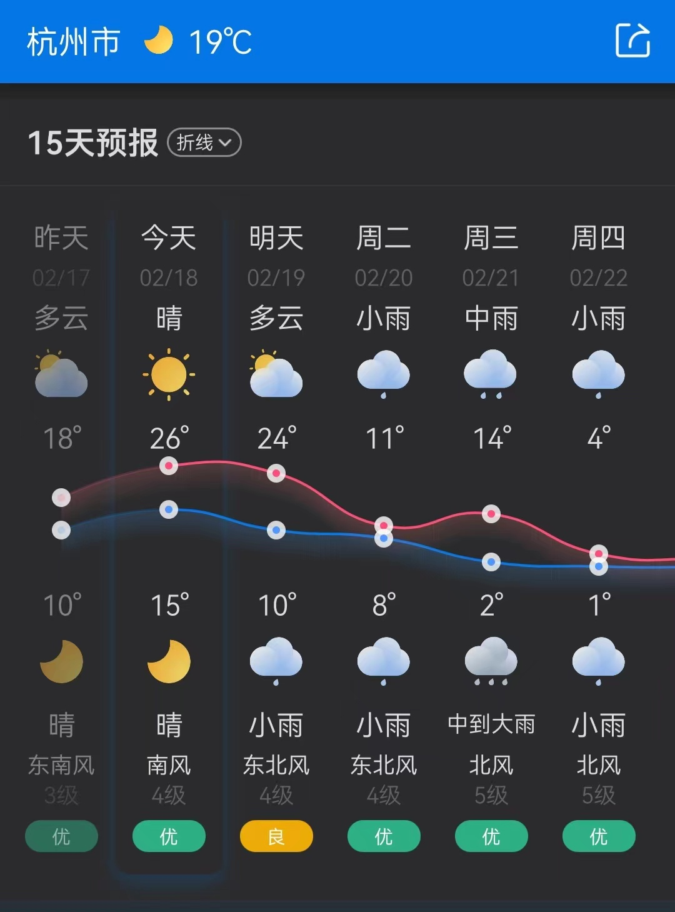

（完，祝好！）

:::tip 文档信息
版权声明：自由转载-非商用-非衍生-保持署名（创意共享3.0许可证） 
发表日期： 2024年2月19日
:::