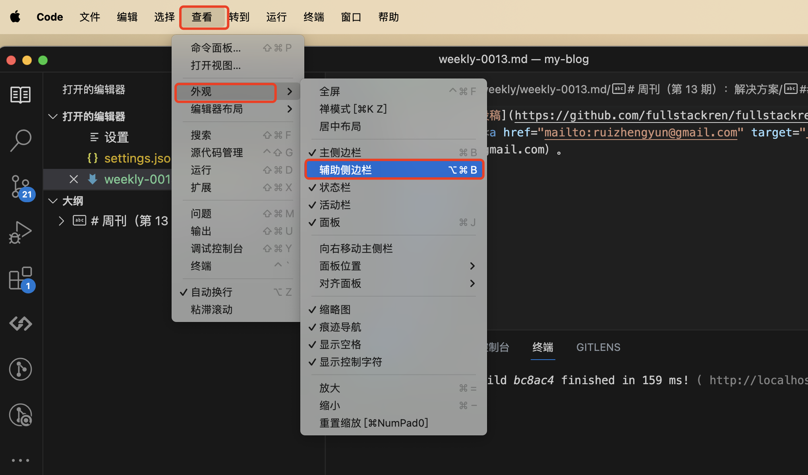
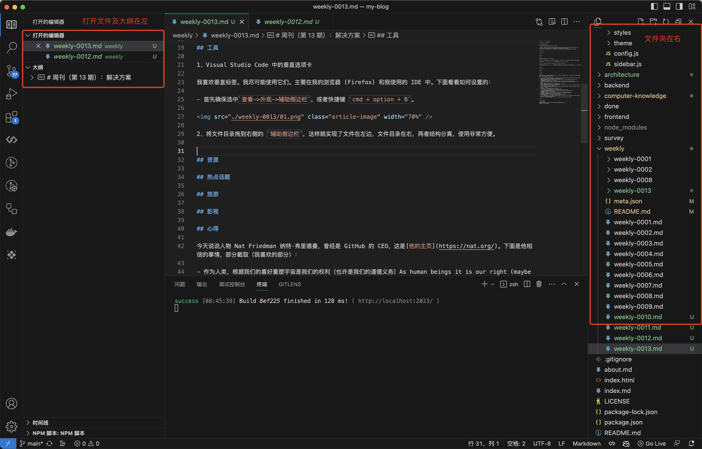
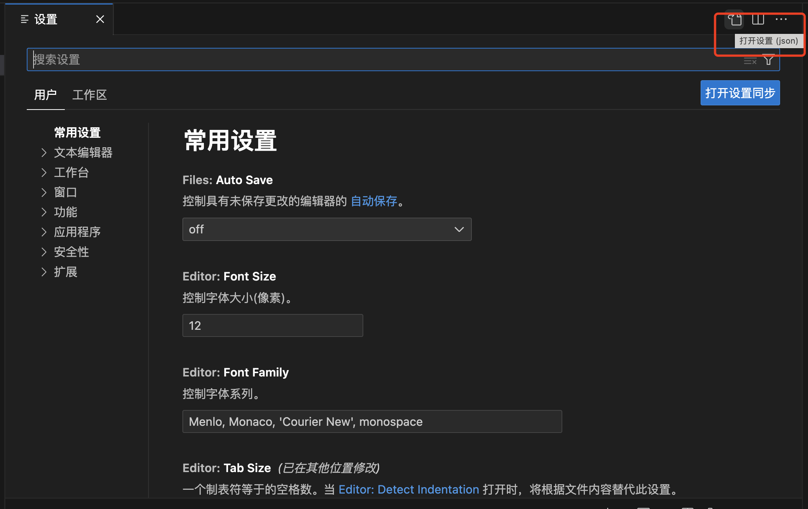
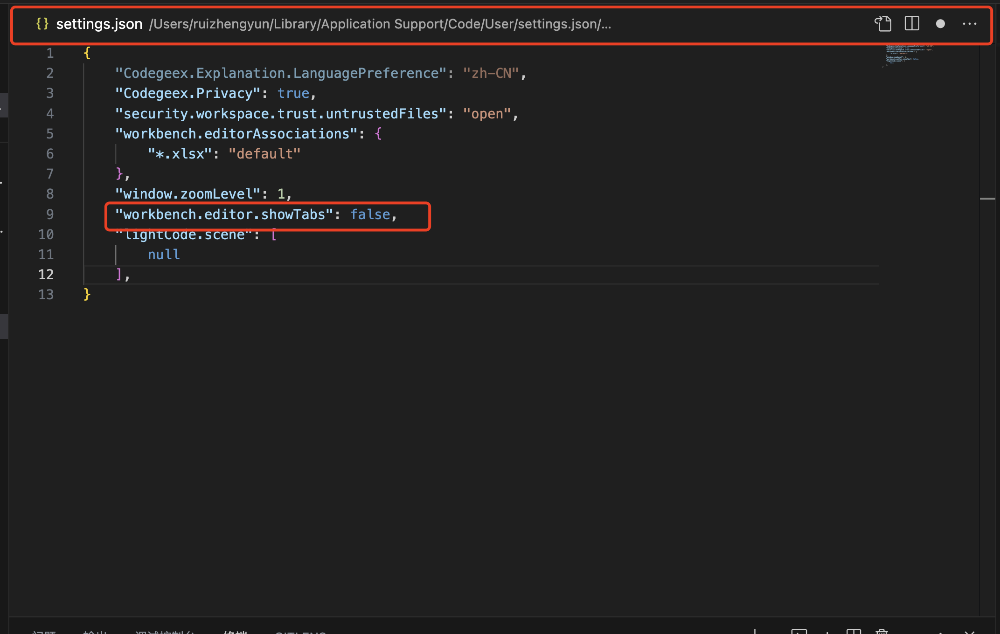
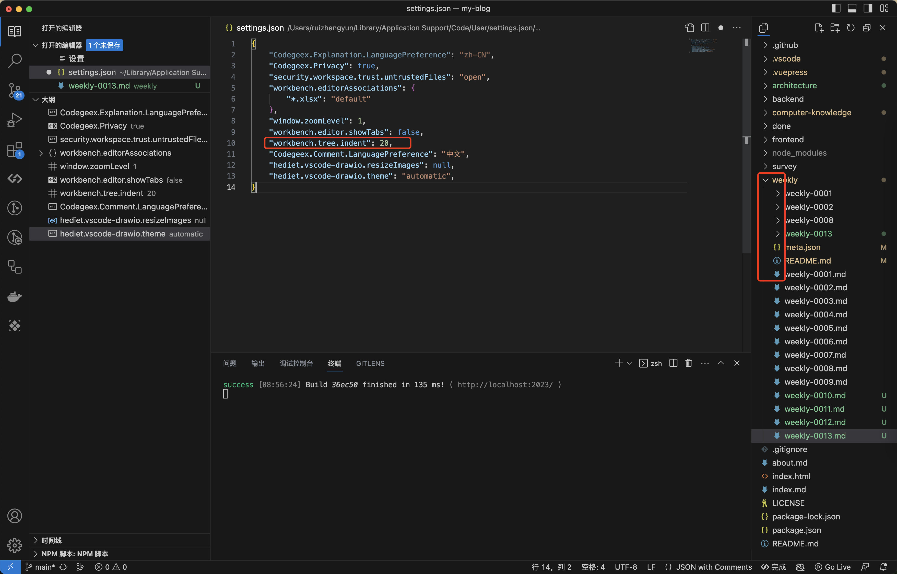
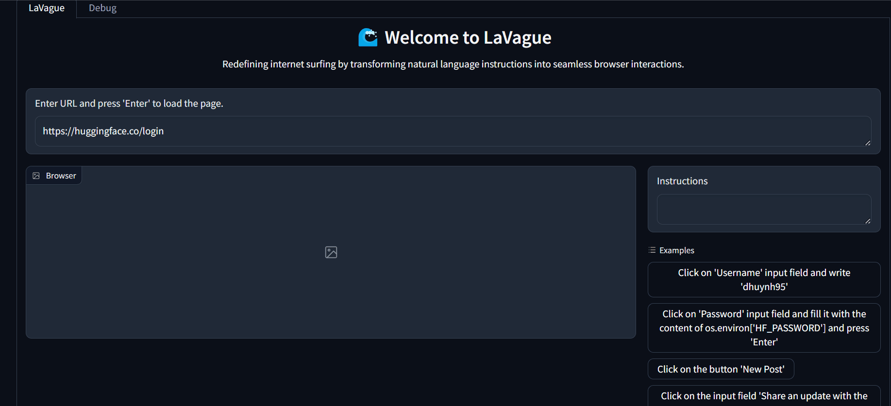
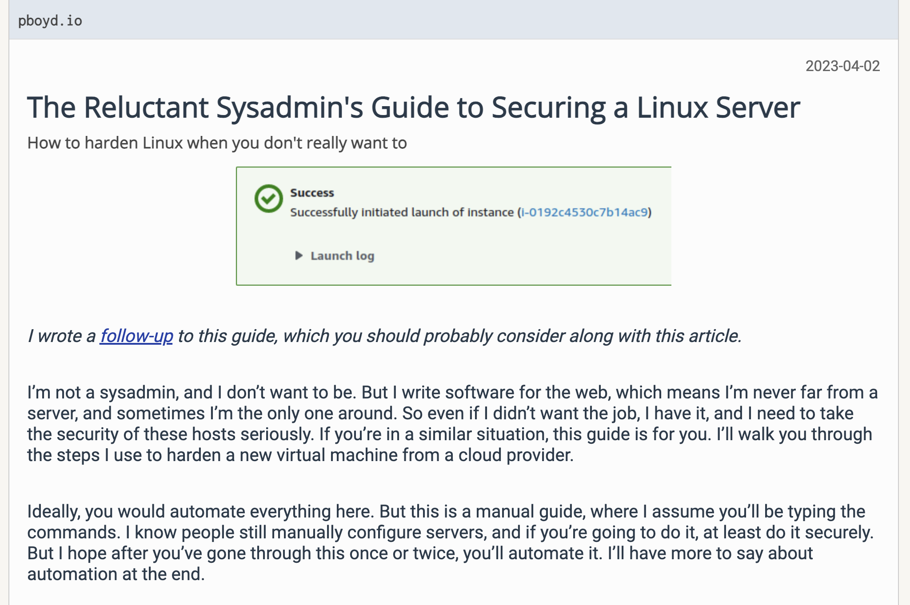

# 周刊（第 13 期）：TODO

> 作者：[西湖前端正正日上](../about.md)
>
> 日期：2024年3月25日
>
> 这里记录每周值得分享的兴趣内容，周一发布。
>
> 本周刊[开源](https://github.com/fullstackren/fullstackren.github.io/tree/main/weekly)，欢迎[投稿](https://github.com/fullstackren/fullstackren.github.io/issues)。合作请<a href="mailto:ruizhengyun@gmail.com" target="_blank">邮件联系</a>（ruizhengyun@gmail.com）。

## TODO

<!--  -->

## 开源

1、Visual Studio Code 中的垂直选项卡

> 原文是：[Vertical tabs in Visual Studio Code](https://weberdominik.com/blog/vscode-vertical-tabs/)。

我喜欢垂直标签。我尽可能使用它们。主要在我的浏览器 (Firefox) 和我使用的 IDE 中。下面看看如何设置的：

- 首先确保选中`查看->外观->辅助侧边栏`（快捷键 `cmd + option + B`）。



2、将文件目录拖到右侧的 `辅助侧边栏`，这样就实现了文件在左边，文件目录在右，两者结构分离，使用非常方便。



3、为了编写聚焦，我还需要将主体区域的选项卡隐藏在顶部。选中 `Code->首选项->设置`（快捷键 `cmd + ,`）。 



4、点击 `打开设置（json）` 图标，添加以下代码：
  
```json
  "workbench.editor.showTabs": false,
```



5、文件结构中的缩进。默认情况下它对我来说太小了，我在打开的 `打开设置（json）` 中添加以下代码：

```json
  "workbench.tree.indent": 20,
```



真香！

2、[LaVague](https://github.com/lavague-ai/LaVague)

想象一下，有一个超级有趣的产品，你只需动动手指，就能像指挥舞者一样在网页上跳来跳去。比如，输入‘点击按钮’，它就会乖乖地按你的指令点击网页按钮。这个魔法背后的秘密就是浏览器自动化框架 [Selenium](https://www.selenium.dev/)。现在，网页操作变得轻松愉快，就像玩游戏一样！



## 资源

1、[Linux 服务器加固指南](https://pboyd.io/posts/securing-a-linux-vm/)（英文）

当架设了一台 Linux 虚拟主机，如何让它变得更安全，本文列出了详细的操作步骤。



## 言论

今天说说人物 Nat Friedman 纳特·弗里德曼，曾经是 GitHub 的 CEO，这是[他的主页](https://nat.org/)。下面是他相信的事情，部分截取（我喜欢的部分）：

- 作为人类，根据我们的喜好重塑宇宙是我们的权利（也许是我们的道德义务）As human beings it is our right (maybe our moral duty) to reshape the universe to our preferences
  - 技术，即真正的知识，使得这一切成为可能 Technology, which is really knowledge, enables this
- 热情很重要！It's important to do things fast
  - 做让你兴奋的事情会更容易 It's much easier to work on things that are exciting to you
  - 因此，做大事可能比做小事更容易 It might be easier to do big things than small things for this reason
  - 能量是进步的必要投入 Energy is a necessary input for progress
- 快速做事很重要 It's important to do things fast
  - 单位时间内你学到的东西更多，因为你更频繁地接触现实 You learn more per unit time because you make contact with reality more frequently
  - 快速行动让你专注于重要的事情；没时间废话了 Going fast makes you focus on what's important; there's no time for bullshit
  - 一周相当于一年的2% A week is 2% of the year 
- 我们知道的比我们想象的要少 We know less than we think
  - 很多我们认为的事情都是错误的 Many of the things we believe are wrong
  - 我们常常甚至没有提出正确的问题 We are often not even asking the right questions
- 较小的团队更好 Smaller teams are better
  - 更快的决策、更少的会议、更多的乐趣 Faster decisions, fewer meetings, more fun
  - 不需要因为政治原因而削减工作 No need to chop up work for political reasons
- 你从哪里获得多巴胺？Where do you get your dopamine?
  - 答案可以预测你的行为 The answer is predictive of your behavior
  - 通过改进你的想法而不是通过验证它们来获得多巴胺更好 Better to get your dopamine from improving your ideas than from having them validated
  - 可以从“让事情发生”中得到你的 It's ok to get yours from "making things happen"


（完，祝好！）

:::tip 文档信息
版权声明：自由转载-非商用-非衍生-保持署名（创意共享3.0许可证）</br>
发表日期： 2024年3月25日
:::
