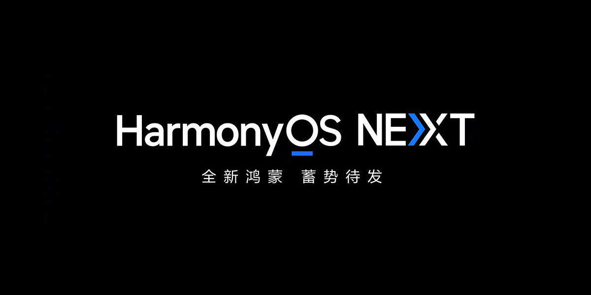
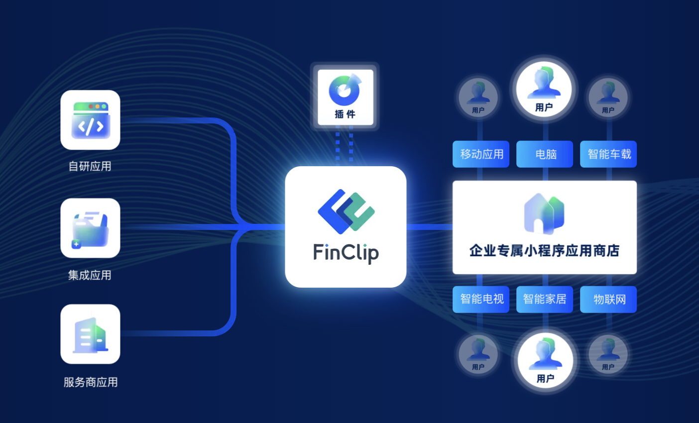
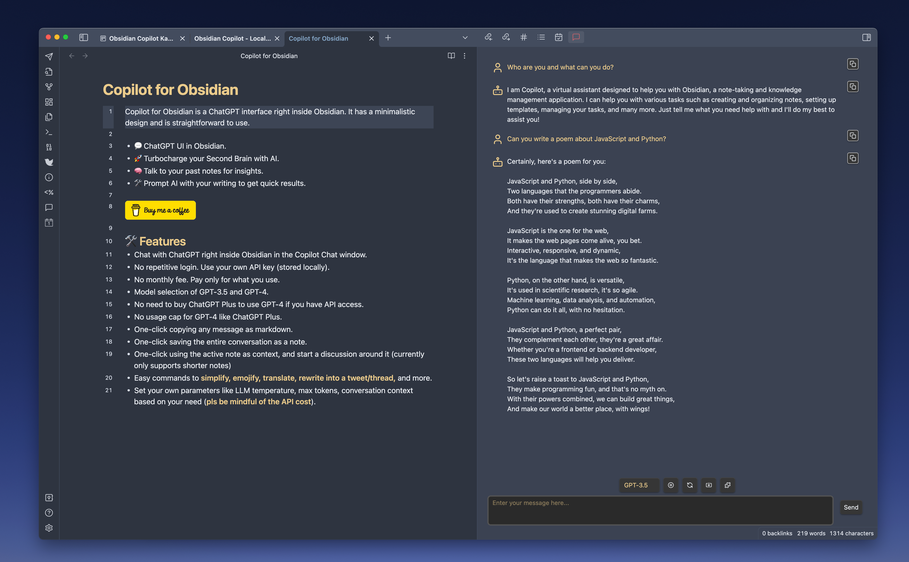
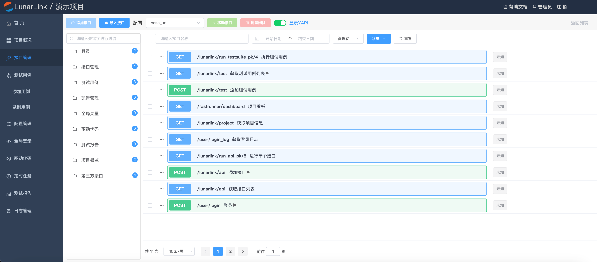
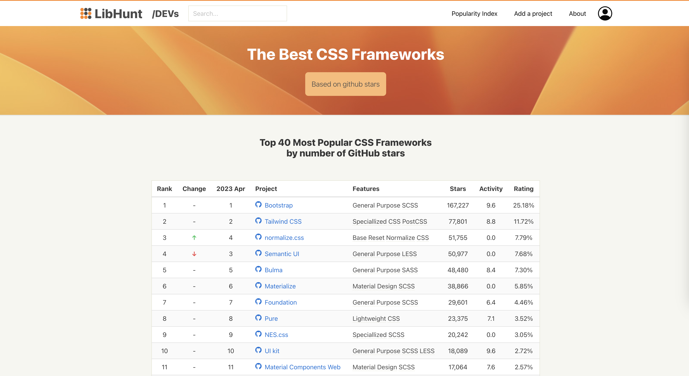
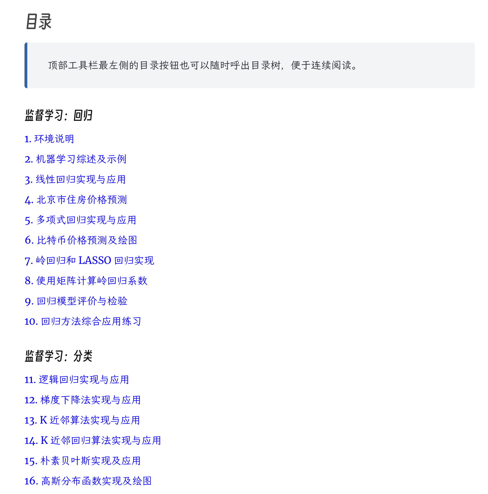
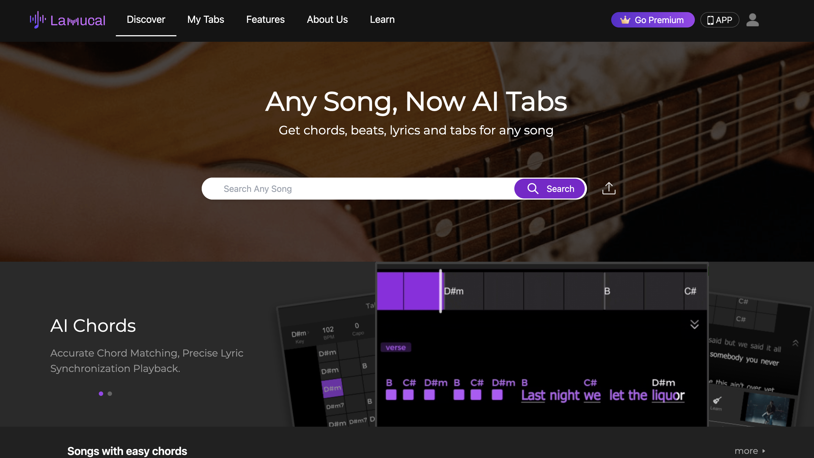

# 周刊（第 15 期）：HarmonyOS NEXT

> 作者：[江湖](../about.md)
>
> 日期：2024年4月8日
>
> 这里记录每周值得分享的兴趣内容，周一发布。
>
> 本周刊[开源](https://github.com/fullstackren/fullstackren.github.io/tree/main/weekly)，欢迎[投稿](https://github.com/fullstackren/fullstackren.github.io/issues)。合作请<a href="mailto:ruizhengyun@gmail.com" target="_blank">邮件联系</a>（ruizhengyun@gmail.com）。

## HarmonyOS NEXT

华为的鸿蒙系统（HarmonyOS）一直以来都是独树一帜的存在。过去，它构建在安卓开源版本 AOSP 的基础上，与安卓应用完美兼容，无需额外开发。然而，现在的情况发生了变化。

华为已经宣布，今年秋季将发布 HarmonyOS NEXT。这是一个全新的操作系统，不再与安卓兼容。

这意味着，所有应用都必须重新开发客户端，从零开始，以实现与现有安卓/苹果客户端完全相同的功能。这将产生巨大的成本。

然而，这个问题是无法回避的。在国内安卓用户中，华为占据着最大的市场份额，而且这些用户通常使用中高端系列产品。此外，华为用户的付费率也是安卓用户中最高的。

根据第三方统计数据显示，截至2023年第一季度，鸿蒙系统的市场占有率已经超过8%，并且仍在逆势增长。尽管这些用户还未使用鸿蒙 NEXT，但对于开发者来说，适配鸿蒙 NEXT 只是时间问题。

政府已经明确支持 HarmonyOS NEXT，[深圳](http://www.news.cn/local/20240303/dca3e6d4bd734380b4dc9602d5df9b76/c.html)、[上海](https://m.21jingji.com/timeline/6d9b6fd73a5bc98a293edc724554a46e.html)、[福州](https://www.fuzhou.gov.cn/zwgk/gb/202301/t20230111_4520047.htm)等城市已经出台政策来支持该系统，许多头部应用（如小红书、支付宝）已经开始适配这一新系统。

对于大型互联网公司来说，适配 HarmonyOS NEXT 只是分配给工程师的任务之一，但对于中小型公司而言，这成为了一个头痛的难题。这些公司本身就缺乏资源，难道还要额外招募鸿蒙工程师吗？如何承担这部分成本呢？

对于中小型应用来说，其实有一个简单的解决方案。

我们知道，H5 是移动平台兼容性最好的开发技术之一。只需略微修改代码，就可以在多种系统中运行，最典型的例子就是小程序。

目前，许多应用都有微信小程序版本。如果有一种工具可以将微信小程序转换为鸿蒙原生应用，那对于大多数中小型应用来说，将提供一种简单且可行的适配方案。

国产软件 [FinClip](https://www.finclip.com/) 就是这样的工具。它是一个小程序容器或小程序 SDK，能够让微信小程序、支付宝卡片在其中运行，而不需要修改任何代码。

它的开发目的是让小程序能够独立于宿主（如微信/支付宝）运行在多种环境中。它兼容微信小程序语法和登录体系，能够让小程序直接在其上运行。目前，它已经支持安卓、iOS、鸿蒙 NEXT、Flutter、Windows、车机等平台。

因此，我们可以使用它一键将小程序转换为鸿蒙 NEXT 原生应用。它的鸿蒙版 SDK 功能与安卓、iOS 保持一致，所有开发组件和接口均与微信对标。本质上，它提供了一个鸿蒙 NEXT 的适配层，让小程序直接在这个适配层上运行，并将它们打包在一起，形成一个独立的应用。

同时，作为适配层，它可以容纳多个小程序。也就是说，您也可以将它作为平台，将现有的各种微信小程序上架，并打造成一个您自己的超级应用。

总之，对于现有的微信小程序来说，FinClip 提供了一个非常简单的鸿蒙 NEXT 适配方案。

## 开源

## 工具

1、[Copilot for Obsidian](https://github.com/logancyang/obsidian-copilot)

Copilot for Obsidian 是 Obsidian 内部的免费开源 ChatGPT 界面。它具有简约的设计并且易于使用。给你的 Obsidian 插上 AI 大模型引擎，参见[这篇文章](https://mp.weixin.qq.com/s/at7K_8lEfVzQJq5qnpzvUg)。

2、[LunarLink](https://github.com/tahitimoon/LunarLink)

一个基于 HttpRunner + Django + Vue + Element UI 的接口自动化测试平台，生产可用。

3、[text2video](https://github.com/bravekingzhang/text2video)

这个工具可以将一段文本转换为视频，并保存到指定的本地，初衷是想实现小说的可视化阅读功能。

4、[Magic Wormhole](https://github.com/magic-wormhole/magic-wormhole)

安全地将东西从一台计算机转移到另一台计算机。该软件包提供了一个库和一个名为 wormhole 的命令行工具，它使得可以从一台计算机到另一台计算机获取任意大小的文件和目录（或短文本片段）。两个端点通过使用相同的“虫洞代码”来识别：通常，发送机器生成并显示代码，然后必须将其输入接收机器中。

## 资源

1、[The Best CSS Frameworks](https://www.libhunt.com/css)

40 个最受欢迎的 CSS 框架 按 GitHub 星星数量。

2、[动手实战人工智能 AI By Doing](https://aibydoing.com/intro)

该篇文章介绍了一本名为《动手实战人工智能》的系列教程，作者从2015年开始了解机器学习，陆续通过Jupyter Notebook编写内容，旨在帮助读者理解机器学习和深度学习的原理，并能够实践应用。文章包括监督学习、无监督学习、机器学习工程、深度学习原理与框架、深度学习应用、深度学习工程以及强化学习等多个主题内容。

3、[z2h字帖](https://paper.z2h.cn/han)

介绍了一款超级好用的字帖生成工具，展示了生成的“江湖和他的朋友们”字帖样本，同时提供了工具的各种设置选项，如显示首字、插入空行、方格类型等。

4、[lamucal](https://lamucal.ai/)

任何歌曲，现在都有 AI 标签 获取任何歌曲的和弦、节拍、歌词和标签。

## 言论

1、[7种肯定会陷入困境的方法（反之亦然）](https://www.ggnotes.com/7-sure-ways-to-get-stuck-do-the-opposite/)

1. 把大部分时间花在你讨厌的事情上；
2. 保持不动；
3. 忽视健康；
4. 保持迷失！不要试图描绘出你的情况；
5. 不要承诺。保持你的选择余地；
6. 过河拆桥。谁关心以前的同事、老板或客户？
7. 永远不要寻求帮助；

好处：沉迷于别人（表面上）的成功，寻求摆脱困境。如果您采取与本文所述相反的做法，您将避免陷入困境。

（完，祝好！）

:::tip 文档信息
版权声明：自由转载-非商用-非衍生-保持署名（创意共享3.0许可证） 
发表日期： 2024年4月8日
:::
