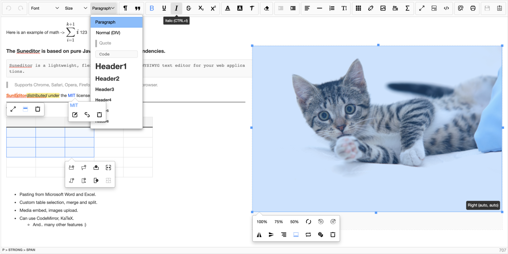
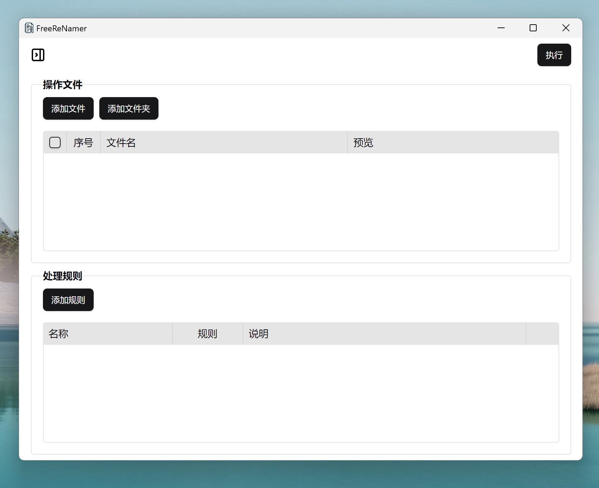
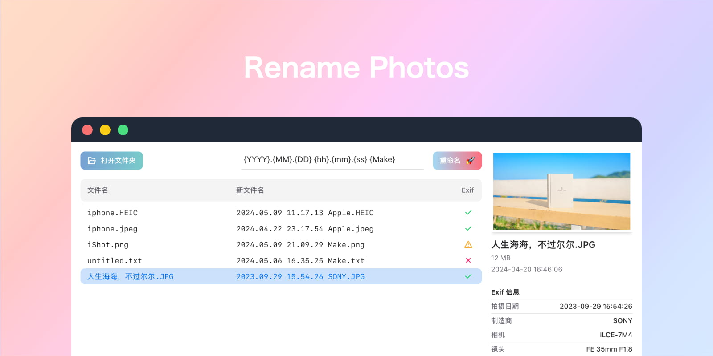
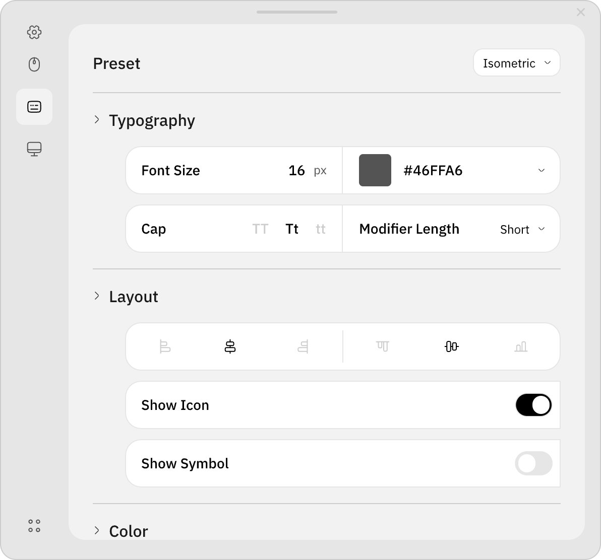
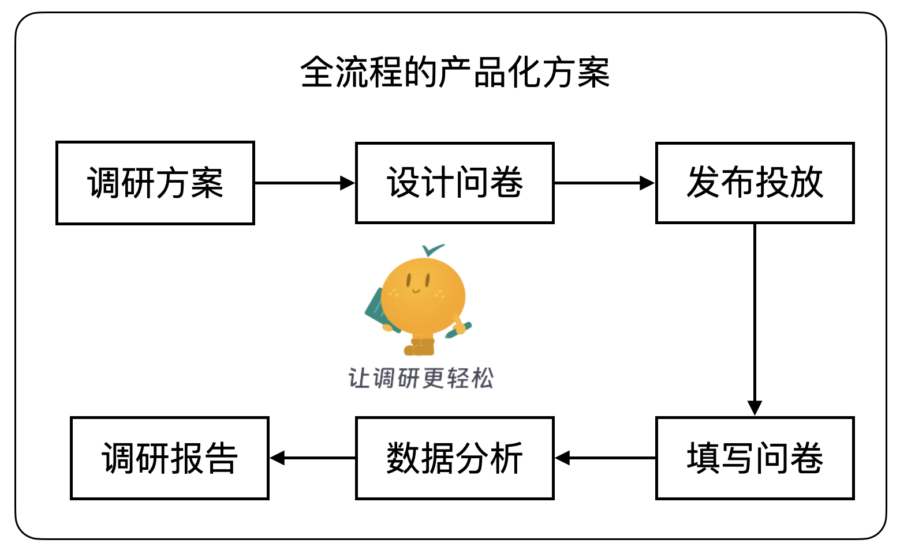
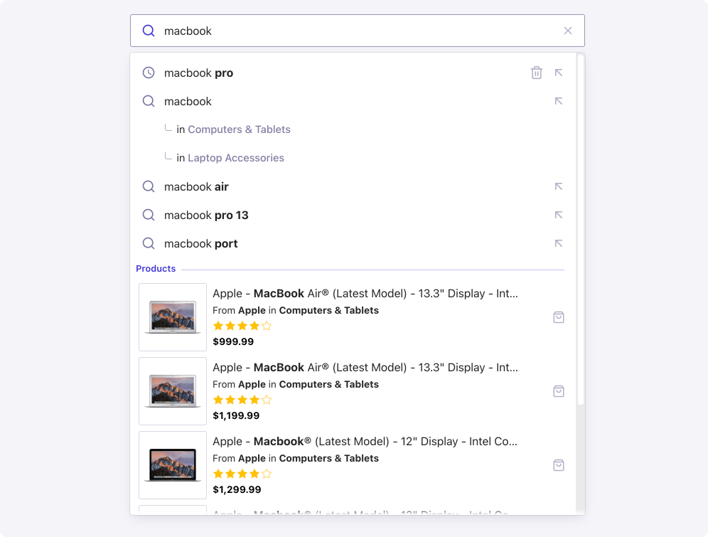
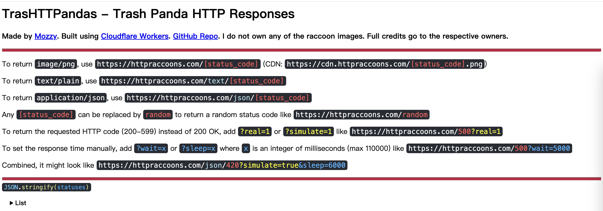
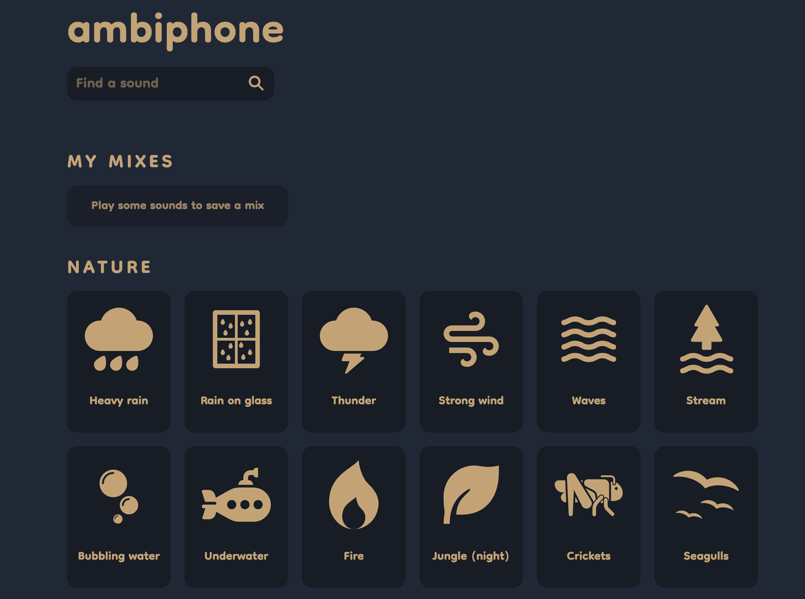

# 周刊（第 22 期）：OpenAI办公地点

> 作者：[江湖](../about.md)
>
> 日期：2024年5月27日
>
> 这里记录每周值得分享的兴趣内容，周一发布。
>
> 本周刊[开源](https://github.com/fullstackren/fullstackren.github.io/tree/main/weekly)，欢迎[投稿](https://github.com/fullstackren/fullstackren.github.io/issues)。合作请<a href="mailto:ruizhengyun@gmail.com" target="_blank">邮件联系</a>（ruizhengyun@gmail.com）。

## OpenAI办公地点

OpenAI 无疑是当下最炙热的 AI 公司。以下是其总部-美国旧金山的办公地点，一栋三层小楼，是由一家食品厂改建的。若光看外面根本想不到，里面在开发人类最先进的人工智能模型。

那办公楼里面是怎样的情形呢？

员工可以挂自己偶像的画。

像不像我们大学的自习室。员工可以在这里安静的学习、思考。气氛宽松，不会压抑。

反观当下的一些公司，空间是开放了，但是都挤在一起，十分喧闹，让人很难集中注意力。

所以我们要努力提升自身技术能力，找到舒适的工作环境，以更好的实现一些愿望和目的。尤其是当下内卷环境。

## 开源

1、[SunEditor](http://suneditor.com/sample/index.html)

纯基于 javascript 的 WYSIWYG html 编辑器，没有依赖项，查看 [Github](https://github.com/JiHong88/suneditor)。

2、[安读](https://github.com/Anxcye/anx-reader)

安读是使用Flutter编写的电子书阅读器，是一款专注于阅读的应用，不包含任何在线推广内容，它可以帮助你更专注于阅读，提高阅读效率。

3、[FreeReNamer](https://github.com/cyhuajuan/FreeReNamer)

功能强大又易用的文件批量重命名软。也提供[在线网页版](https://renamer.cyhuajuan.site/profile/80qwOptB)。

4、[Rename Photos](https://github.com/Arman19941113/rename-photos)

Rename Photos 是一个使用 EXIF 数据给**图片重命名**的跨平台桌面应用。如果你的文件缺少 EXIF 数据，软件也能工作。

5、[Keyviz](https://github.com/mulaRahul/keyviz)

Keyviz 是一款免费的开源工具，可实时可视化您的击键 ⌨️ 和 🖱️ 鼠标操作。

6、[XIAOJUSURVEY](https://github.com/didi/xiaoju-survey)

XIAOJUSURVEY是一套轻量、安全的问卷系统基座，提供面向个人和企业的一站式产品级解决方案，快速满足各类线上调研场景。

7、[autocomplete](https://github.com/algolia/autocomplete)

一个 JavaScript 库，可让您快速构建自动完成体验。

## 工具

1、[TrasHTTPandas](https://httpraccoons.com/)

这个网站提供各种状态码的 HTTP 回应，供 API 调用，可以用来调试前端请求。

2、[VSpace](https://vspace.cyhuajuan.site/)

侧边栏垂直书签和标签页管理器，让你拥有更好的浏览器体验。

3、[ambiphone](https://ambiph.one/)

这个网站可以播放环境音和白噪声，适合当作背景音乐。

4、[代理检测](https://proxy.incolumitas.com/proxy_detect.html)

该网站提供一系列测试，用来检测用户是否正在使用代理。

## 资源

1、[学习 Rust 的 100 个练习](https://rust-exercises.com/01_intro/00_welcome)

Rust 语言的一个初学者教程，通过100个练习来学习这门语言。

2、[JavaScript 语法问题](https://github.com/lydiahallie/javascript-questions/blob/master/zh-CN/README-zh_CN.md)

这个仓库收集了100多个 JavaScript 的语法选择题，可以试试你是否真的了解这门语言。

## 言论

1、我的职业建议是，行动要急不可耐，对于结果要抱有耐心。-- [《给年轻自己的职业建议》](https://noahkagan.com/brutally-honest-career-advice-to-my-younger-self/)

2、20多岁时，我跟一个长辈说："我很担心，别人会怎么看待我做的那个决定。"长辈说："放心吧，你没有观众的。" 现在想起来，我认为这是我得到过的最好建议。-- 阿曼达·福蒂尼（Amanda Fortini），美国作家

（完，祝好！）

:::tip 文档信息
版权声明：自由转载-非商用-非衍生-保持署名（创意共享3.0许可证） 
发表日期： 2024年5月27日
:::
