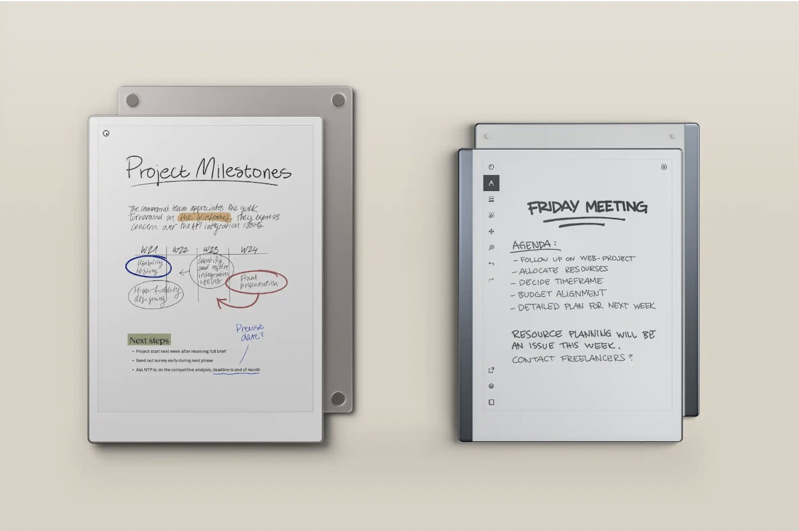
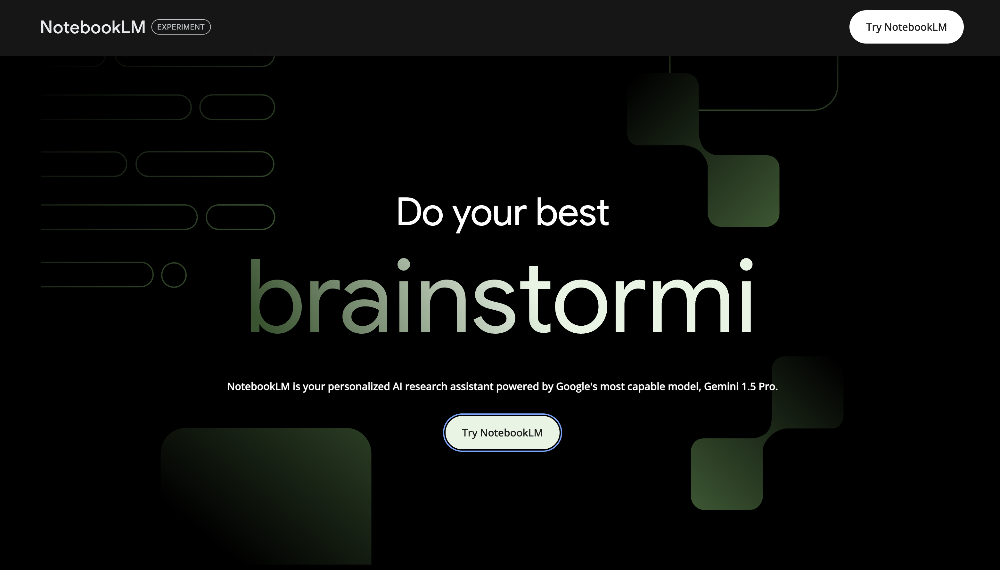

# 周刊（第 39 期）：TODO

> 作者：[西湖前端正正日上](../about.md)
>
> 日期：2024年9月23日
>
> 这里记录每周值得分享的兴趣内容，周一发布。
>
> 本周刊[开源](https://github.com/fullstackren/fullstackren.github.io/tree/main/weekly)，欢迎[投稿](https://github.com/fullstackren/fullstackren.github.io/issues)。合作请<a href="mailto:ruizhengyun@gmail.com" target="_blank">邮件联系</a>（ruizhengyun@gmail.com）。

## TODO

<!--  -->

## 开源

## 工具

### 1、[reMarkable Paper Pro](https://remarkable.com/)

用感觉像纸质的数字笔记本取代您的笔记和打印文档。

2、[NotebookLM](https://notebooklm.google/)

NotebookLM 是一个开源项目，旨在为用户和开发者提供一种简单、高效的方式来管理和运行机器学习模型。它支持多种机器学习框架，包括 TensorFlow、PyTorch、Keras 等，并且可以轻松地与 Jupyter Notebook 集成。

3、[Notion](https://www.notion.so/)

Notion 硅谷的独角兽，是一个强大的协作工具，可以帮助团队更好地组织和协作。它支持多种功能，包括文档、表格、看板、日历等，并且可以轻松地与其他工具集成。它从 1.0 到 3.0，本质上就是在构建一个低代码产品。企业可以用 Notion 建网站、管理项目。

## 资源

## 小技巧

### 1、微信可查看添加好友时间

- 更新正式版本（IOS更新微信 8.0.52 版本）；
- 进入微信「通讯录」页面，或搜索好友，点击头像；
- 在好友的个人资料页面点击「更多信息」；
- 在来源信息中，可以看到「添加好友」。

## 人物

### 1、保罗·格雷厄姆

保罗·格雷厄姆是互联网圈子里灯塔般的人物，他不仅写过畅销书《黑客与画家》，而且还创办了全球著名的创业孵化器 YC。前不久，格雷厄姆写了一篇题为《创始人模式》的文章。他说，有两种不同的公司经营方式：创始人模式和经理人模式。到目前为止，即使是在硅谷，大多数人也会默认，随着初创企业的发展，创始人必须切换到经理人模式。但我们可以从那些尝试过经理人模式的创始人的失望，以及他们逃离这一模式后的成功中，推测出另一种模式的存在。包括马斯克、Shopify 创始人等企业家都转发帖子赞同格雷厄姆的观点。格雷厄姆的大致意思：企业做大之后，不一定非要像很多人建议的那样——创始人放权，然后让企业过渡到职业经理人模式上。虽然不乏微软这种靠职业经理人模式取得非凡成绩的公司，但这并不是标准答案。随着认知的成熟，估计越来越多的企业会坚持走创始人模式。

## 言论

（完，祝好！）

:::tip 文档信息
版权声明：自由转载-非商用-非衍生-保持署名（创意共享3.0许可证） 
发表日期： 2024年9月23日
:::
